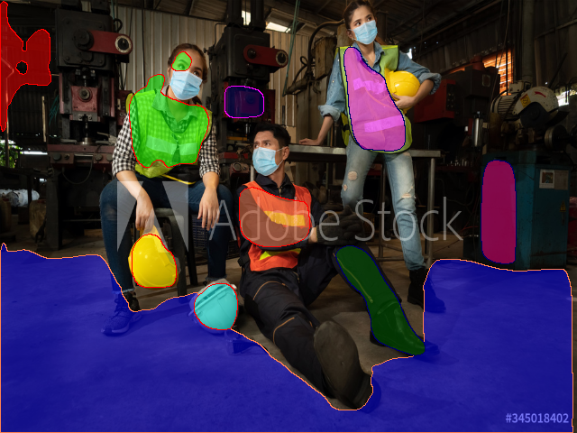

## Sesson 15: Multiobjective model which perform the following tasks

1.  Predict the boots, PPE, hardhat, and mask if there is an image
2.  Predict the depth map of the image
3.  Predict the Planar Surfaces in the region

Most of the Deep Learning problems in the real time usually have to achieve multiple targets, which are often conflicting with each other. For example in feature selection, minimizing the number of features and the maximizing feature quality are two conflicting objectives. It is also well realized that model selection has to deal with the trade-off between model complexity and approximation or classification accuracy. Traditional learning algorithms attempt to deal with multiple objectives by combining them into a scalar cost function so that multi-objective machine learning problems are reduced to single-objective problems. 

Recently, increasing interest has been shown in applying Pareto-based multi-objective optimization to machine learning, particularly inspired by the successful developments in evolutionary multi-objective optimization. It has been shown that the multi-objective approach to machine learning is particularly successful in 

1) Improving the performance of the traditional single-objective machine learning methods 
2) Generating highly diverse multiple Pareto-optimal models for constructing ensembles and, 
3) In achieving a desired trade-off between accuracy and interpretability of neural networks or fuzzy systems.

## RealTime usecases of Object Detection, Depth Estimation and Plane Surface Detection.

**Object detection:**

 - Object detection is a basic requirement that is needed in robotic industry to identify the object and perform useful task. 
 - The robot with the help of camera, scans the environment and detects the objects present and obtain its location on the scaned scene.
 - With the help of interested object location in a scene, the robot can choose to perform activities like moving towards it or away from it, picking the object or placing the object etc.
 
**Depth Estimation:**
 
 - Depth estimation is an important function in robotic industry to gather the disparity among objects present in the given scene.
 - The depth information helps the robot to navigate in a given scene by avoiding colision with the objects, hitting any object, picking any object etc.
 - Based on the shift, scale and disparity information the robot makes the decision that has to be done with the objects present in the scene.
 
**Plane Detection:**
 - plane detection technique has been widely used in robot navigation in identifying wall, floor, steps, furniture etc.
 - Depth cameras or LIDAR are used to get the plane segmentation and detect the plane surface.
 - Plane Detection are widely used in Augumented reality application to identify the plane surface and bring in virtual objects into the virtual scene.
 
In order to achive depth estimation and plane detection, we need expensive equipments like depth camera and LIDAR. But after the possibility of creating and executing Deep Neural Networks in modern world, these problems which was challenging are now able to predict with out expensive hardware involvement. 

In object detection the computer must identify the object of our interest in the given image and mark the bounding box surrounding the identified image.

TestInput Image and BBox detections:

  
  

In Depth Estimation, the machine has to extract the depth information of the foreground entities from a single image. Example below shows the extracted depth information (on the right) from an image (on the left).

  

In Plane Surface Estimation, the machine has to detect the plane surface information from the depth and mask entities from a single image.

  

- [Dataset](dataset.md)
- [Model Architecture](ModelArchitecture.md)
- [Multi objective model Losses](LossFunction.md)
  - [Bounding box Prediction](LossFunction.md#bounding-box-prediction)
  - [Depth Prediction](LossFunction.md#depth-loss-function)
- [Training](training.md)
- [Steps to run](steps.md)
