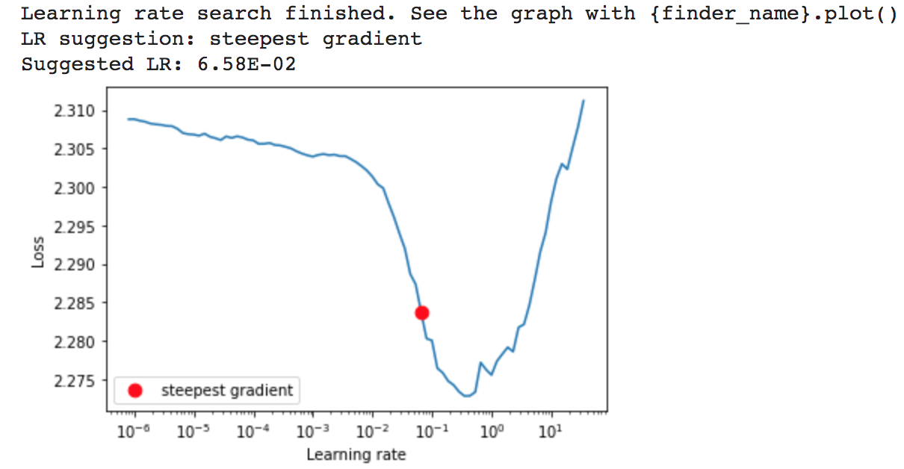
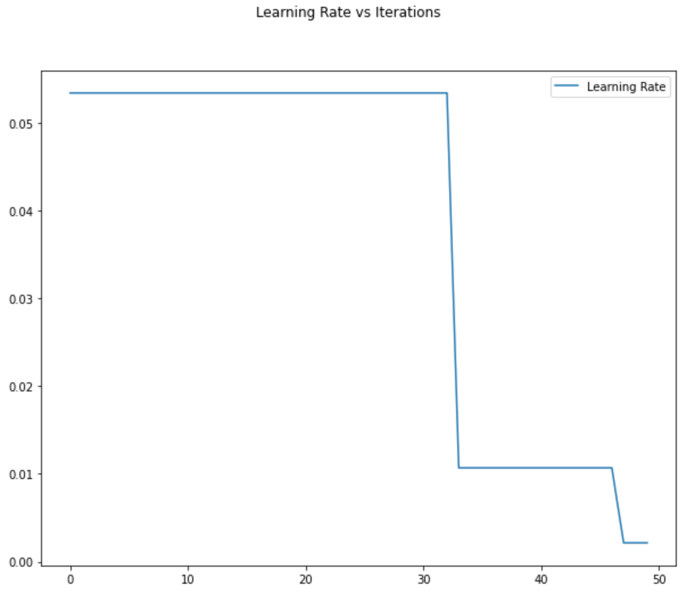
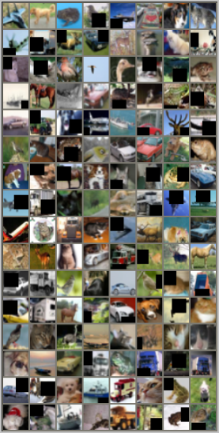
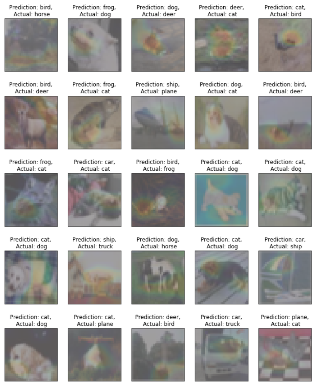

## Session 10 Assignment - Team Submission
Team Members
1. S.A.Ezhirko
2. Naga Pavan Kumar Kalepu

**LRs and LR Scheduler ReduceLROnPlateau:**

We implemented a method **get_best_lr_sgd** which takes the inputs [model, trainloader, lr=1e-7, momentum=0.9, end_lr=100, num_iter=100] and process them
using **LRFinder** and returns lr_finder object & plots the graph between **learning rates** and **Loss** as below.



And we implemented a method **get_reducelronplateau_scheduler** which takes the inputs [optimizer, mode, factor, patience, threshold, threshold_mode, cooldown,
min_lr] and process them using **ReduceLROnPlateau**

To get the best validation accuracies of the model, we tried to tune the various learning rates and ReduceLROnPlateau parameters [factor, patience, cooldown].

When we ran lr_finder for multiple times we got below suggested best LRs

- 1.52E-01
- **1.00E-01**
- **6.58E-02**
- **1.00E-01**
- **1.00E-01**
- **5.34E-02**
- **6.58E-02**
- **5.34E-02**
- 2.31E-01

Out of these, we tried frequently suggested LRs **1.00E-01**, **6.58E-02** and **5.34E-02** with various combinations of ReduceLROnPlateau parameters.

And also we added a method **get_lr(optimizer)** to catpure and monitor change in learning rate by ReduceLROnPlateau. This helps us to get the intuition behind setting the right value of patience, factor and cooldown parameters.

**Our observations and intuition behind reaching best combination:**

1. We monitored the change in learning rate by ReduceLROnPlateau w.r.to the change in loss and observed the patience around the value 5 gives good results after tried with different patience values 2, 3, 5, and 10 by keeping other parameters constant.
2. We did similar experiement on factor with different values 0.1, 0.2 and 0.3 by keeping other parameters constant and observed 0.2 gave better results compared to others. When we increase the factor from default value 0.1 to 0.2, it has given better results but when we increased factor from 0.2 to 0.3, we observed there were lot of fluctuations in loss and accuracy curves.
3. We also tried cooldown with different values 0 and 1. As cool down waits to make effect of new LR updated by ReduceLROnPlateau for certain number of epochs based on the number you define to cooldown parameter. But we observed it has slow down the training to some extent.
4. With Final resultant combination patience=5, factor=0.2 and cooldown=0 with other parameters' default values we tried the frequently suggested learning rates **1.00E-01**, **6.58E-02** and **5.34E-02**. And we got **best validation accuracy of 91.60 %** with learning rate **5.34E-02**.

**Our Experiments:**

```
TA - Training Accuracy and VA - Validation accuracy

init LR = 0.1

Patience - 3 and factor-0.1, cool down - 0 - 95.28(TA) and 89.29(VA)
Patience - 2, and factor - 0.1, cool down - 0 - 96.01(TA) and 89.96(VA) 
Patience - 2, and factor - 0.1, cool down - 1 - 90.53(TA) and 86.72(VA) - cooldown didn’t help (waiting for certain number of epochs (1) before making the reduced learning rate get effected)
Patience - 2 and factor- 0.2,  cool down - 0 - 92.94(TA) and 88.17(VA) 
Patience - 3 and factor-0.2, cool down - 0 - 96.12(TA) and 90.08(VA) 
Patience - 3 and factor-0.3, cool down - 0 - 95.30(TA) and 90.0(VA)

Init LR =6.58E-02

Patience - 3 and factor-0.2, cool down - 0 - 96.47(TA) and 90.76(VA)

Init LR = 5.34E-02

Patience - 3 and factor-0.2, cool down - 0 - 96.47(TA) and 90.08(VA)
Patience - 5 and factor-0.2, cool down - 0 - 97.80(TA) and 91.60(VA) - Best results

```

And we plotted captured change in LRs by ReduceLROnPlateau during our final model training as below and observed that LR got reduced at 33rd and then at 47th epoch by ReduceLROnPlateau, so higher learning rate helped the early epochs from 1 - 32, but after that lower learning rate helped while reaching near the optimal local minima.



**********************************************************************************************************************
### Cutout Image augumentation
Data augmentation is one solution to avoid overfitting a training dataset of images. While dropout is a very common technique which directly affect the model parameters, might not always be the best choice for regularization. Some reasons for that are that those methods require larger datasets since the model’s capacity is randomly reduced.<br /><br />
The Cutout Augmentation is simple and easy to implementation. The algorithm works by simply masking out contiguous squares of an image. Cutout augmentation forces a CNN model to develop a more diverse set of features for classifying images. Instead of just focusing on the wheels of a car, Cutout forces the model to look at other details of the image.<br /><br />
The CIFAR 10 dataset is used in this assignment for trainning. In this dataset image size is 32x32, hence the cut out height and width is choosen to be 16. i.e 50% of the image size in height and width which covers 25% area of the image. Number of holes was choosen to be 1 for experimentation purpose and calculated mean on CIFAR 10 data set is used to fill the cutout portion. After applying Cutout augmentation, the overfitting of the model significantly reduced and help to perform better. <br /><br />

The model after training for 50 epochs <br /><br />
Train accuracy: 97.80<br />
Test accuracy: 91.60<br />



### Gradcam Misclassification image

The Trained model was made to do prediction on test data using test dataloader, the test images were passed to the gradcam class to get the mask and heatmap image.
A custom Gradcam image visualization function is written which will display 25 misclassified images in a 5x5 image grid. The actual and predicted label will be printed above the gradcam image.


