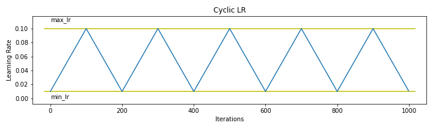
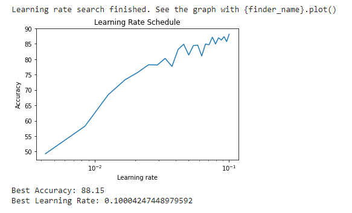

## Session 11 Assignment - Team Submission
Team Members
1. S.A.Ezhirko
2. Naga Pavan Kumar Kalepu

**CLR(Cyclic Learning Rate) Curve:**  

**Modified Version of ResNet model summary:**  

**Model Graph:**  

**LR Range Test Results Graph:**  

**One Cycle LR Graph:** 

**Experiments Results:** 

**Our observations or Learnings from this Assignment:**

1. We should not apply too much image augumentation (higher probability of each image augmentation technique) and have to apply what its required, as we have seen model drops it's accuracy when we applied higher regulirisation. And when we reduced the probabilities for some image augmentation techniques, accuracies started increasing.

2. Higher batch sizes gives better accuracy

3. Higher LR gives balanced class wise accuracy and reduced overfitting compare to lower LR model. So higher LRs are regularising the network.

4. We got highest test accuracy of 90.78% and traning accuracy of 99.02%, but this experiment's model is overfit, so tried to change the hyper parameters of cutout and fliplr accordingly and made model regularized in a better way and we got test accuaracy of 90.55% and train accuracy of 95.99%.

