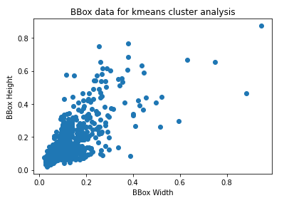
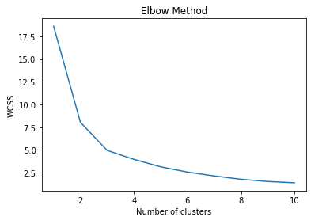

## Session 12 - Team Submission
Team Members
1. S.A.Ezhirko
2. Naga Pavan Kumar Kalepu
**********************************************************************************************************************
## **Assignment A - Tiny ImageNet**  [Code](https://github.com/eva5covergence/EVA5_AI_Projects_new/blob/master/orchestrators/Session12_Assignment.ipynb)


Used standard ResNet18 model architecture  on **Tiny ImageNetData Set**

### **Implementation**

***Added [tinyimagenet](https://github.com/eva5covergence/EVA5_AI_Projects_new/blob/master/data/tiny_imagenet.py) file for processing of tiny image net data.***

1. tiny_imagenet.py to download, mix train and test, split and convert to the dataset format.
2. Changes are done to Data loader class to handle tiny imagenet data loading.
3. Modified Resent18 method to pass 200 classes to support tiny imagenet dataset
4. Used One Cycle Policy as Scheduler. It yielded better and fast results than others
5. Reached the target accuracy

### **Parameters**

1. Agumentations - Horizontal flip, Padding , Random Crop, Center Crop, Normalisation, Cutout
2. Batch Size - 126
3. Model - Resnet 18 with 200 classes
4. Optimiser - SGD(momentum - 0.9 )
5. Scheduler - One Cycle (  max_lr=0.10004247448979592, epochs=50, pct_start=15.0/50.0, steps_per_epoch = math.ceil(77000/128.0), 
                  cycle_momentum=False, div_factor=10, final_div_factor=1, anneal_strategy="linear")

### **Results**

1. Best train Accuracy - 98.30%
2. Best test Accuracy - 57.58%
3. Accuracy Change Graph


## **Assignment B - Find out the best total numbers of clusters**

To download 50 images of people with Hard hat, Vest, Mask and Boots, annotate with vgg annotator, find out the best no of clusters
 
 **Visualisation of Ezhirko PPE data clusters**
 

 
 **Elbow method to find out K in Ezhirko PPE Dataset **
 



## **Assignment B - Dataset Creation**

We collected 60 images and 70 images individually. And annotated bounding boxes for a) hardhat, b) vest, c) mask, d) boots using VGG tool suggested in assignment instructions.

And below is the statistics of object classes across images.

**Ezhriko's images statistics:**

```
**** Object class counts in all the images ****

 hardhat    198
boots      184
vest       182
mask       135
Name: object_name, dtype: int64
```
**Pavan's images statistics:**

```
**** Object class counts in all the images ****

 vest       170
boots      156
mask       130
hardhat    116
Name: object_name, dtype: int64
```


**Based on above graph through elbow method, 2 or 3 anchor boxes per grid cell will be good.**


Data columns (total 14 columns):
 #   Column           Non-Null Count  Dtype  
---  ------           --------------  -----  
 0   img_name         572 non-null    object 
 1   img_width        572 non-null    float64
 2   img_height       572 non-null    float64
 3   object_name      572 non-null    object 
 4   x                572 non-null    float64
 5   y                572 non-null    float64
 6   cx               572 non-null    float64
 7   cy               572 non-null    float64
 8   bb_width         572 non-null    float64
 9   bb_height        572 non-null    float64
 10  cx_s_img         572 non-null    float64
 11  cy_s_img         572 non-null    float64
 12  bb_width_s_img   572 non-null    float64
 13  bb_height_s_img  572 non-null    float64
 
 
