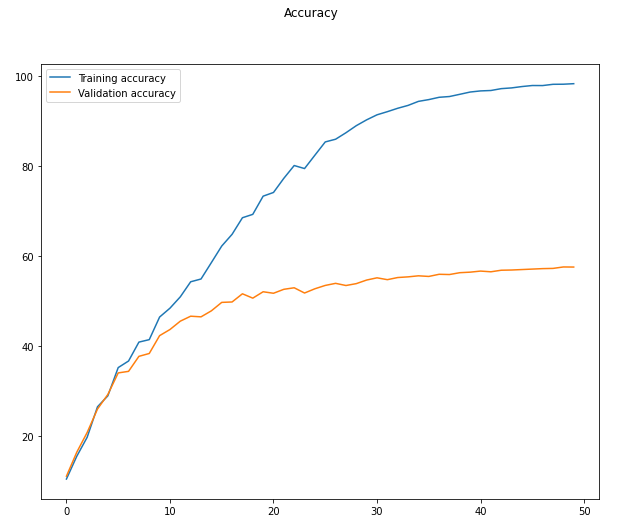

## Session 12 - Team Submission
Team Members
1. S.A.Ezhirko
2. Naga Pavan Kumar Kalepu
**********************************************************************************************************************
## **Assignment A - Tiny ImageNet**  [Code](https://github.com/eva5covergence/EVA5_AI_Projects_new/blob/master/orchestrators/Session12_Assignment.ipynb)

Used standard ResNet18 model architecture  on **Tiny ImageNetData Set**

### **Implementation**

***Added [tinyimagenet](https://github.com/eva5covergence/EVA5_AI_Projects_new/blob/master/data/tiny_imagenet.py) file for processing of tiny image net data.***

1. tiny_imagenet.py to download, mix train and test, split and convert to the dataset format.
2. Changes are done to Data loader class to handle tiny imagenet data loading.
3. Modified Resent18 method to pass 200 classes to support tiny imagenet dataset
4. Used One Cycle Policy as Scheduler. It yielded better and fast results than others
5. Reached the target accuracy

### **Parameters**

1. Agumentations - Horizontal flip, Padding , Random Crop, Center Crop, Normalisation, Cutout
2. Batch Size - 126
3. Model - Resnet 18 with 200 classes
4. Optimiser - SGD(momentum - 0.9 )
5. Scheduler - One Cycle (  max_lr=0.10004247448979592, epochs=50, pct_start=15.0/50.0, steps_per_epoch = math.ceil(77000/128.0), 
                  cycle_momentum=False, div_factor=10, final_div_factor=1, anneal_strategy="linear")

### **Results**

1. Best train Accuracy - 98.30%
2. Best test Accuracy - 57.58%
3. Accuracy Change Graph

