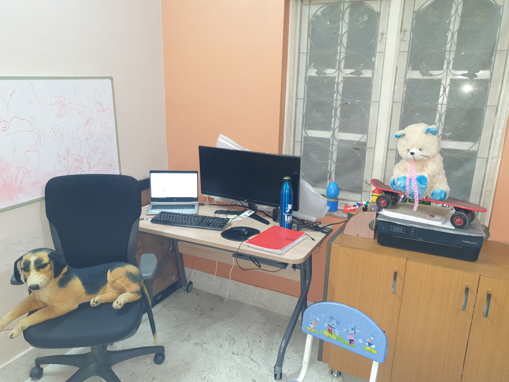
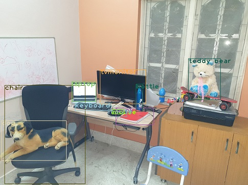

## Session 13 Assignment - Team Submission
Team Members
1. S.A.Ezhirko
2. Naga Pavan Kumar Kalepu
**********************************************************************************************************************
### OpenCV Yolo.

1. Used the code example and the pre-trained yolo weights available in the [location](https://pysource.com/2019/06/27/yolo-object-detection-using-opencv-with-python/) for implementation.
2. Went over the configuration settings mentioned in yolov3.cfg and understood the below important terms needed for second assignment
  - burn_in: Similar to warmup in one cycle policy. The learning rate reaches to maximum till this epoch and then lowers to reach the best minima.
  - max_batches: The training will be processed for this number of batches only.
  - steps : at these numbers of iterations the learning rate will be multiplied by scales factor
3. Looked at coco.names and got to know the list of classes that model is capable of identifying
4. Used the below image of my room for detection

   
  
5. The resultant image after bounding box prediction of classes and their probability.

   

  

