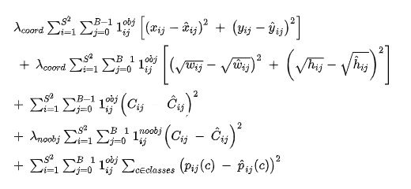

# Loss Function

## Bounding box prediction for object detection

The first stage in building a model was to try out predicting just the bounding box and depth map. The bounding box cordinates were normalized to suit different aspect ratio of the images and 3 anchor boxes where choosen using K mean clustering. The model during training is going to predict the proportion of the bounding boxes and not the absolute bounding box based on the objectness probability. 

### Yolo Loss function
 <p align="center">
  
 </p>
 
 The output image is divided into multipled sections. Each section is a grid which will predict the objectness, probability of the class and its coordinates. The first two equations in the loss equation are responsible to predict the coordinates. Third equation gives the probabiliy of class being present. The fourth equation gives the probability of class not being present. For each grid, this equation is run to find the probability of objectness and only if the object is present, the class is going to be predicted and the bounding box coordinates are going to be predicted. 
 
 x is the normalized value of center x-coordinate of the bounding box
 y is the normalized value of center y-coordinate of the bounding box
 
 ẋ is the predicted center x-coordinate of the bounding box
 ẏ is the predicted center y-coordinate of the bounding box
 
 w is the normalized value of width of the bounding box
 h is the normalized value of height of the bounding box
 
 ẇ is the predicted width of the bounding box
 ḣ is the predicted height of the bounding box
 
 c is the probability of object being present
 ċ is the predicted probability of object being present
 
 p is the actual class
 ṗ is the predicted class
 
 i is the index of grid in the image
 j is the index of the bounding box
 
Yolov3 instead of sending the class probabilty through Softmax it used Sigmoid function. Non-maximum Suppression technique is used that helps selects the best bounding box among overlapping proposals.


### Depth Loss function

Two loss function SSIM and RMSE are combined to generate the loss for the depth image.

### The Structural Similarity Index (SSIM) Loss

- SSIM loss will look for similarities within pixels; i.e. if the pixels in the two images line up and or have similar pixel density values.
- **Standardized Values**: SSIM puts everything in a scale of -1 to 1. A score of 1 meant they are very similar and a score of -1 meant they are very different.

### RMSE (Root Mean squared Error) and Gradient loss

- Compute scale and shift of the pixels of the predicted image
- Calculate the gradient loss with below calculations.
    ```
    diff = prediction - target
    diff = torch.mul(mask, diff)

    grad_x = torch.abs(diff[:, :, 1:] - diff[:, :, :-1])
    mask_x = torch.mul(mask[:, :, 1:], mask[:, :, :-1])
    grad_x = torch.mul(mask_x, grad_x)

    grad_y = torch.abs(diff[:, 1:, :] - diff[:, :-1, :])
    mask_y = torch.mul(mask[:, 1:, :], mask[:, :-1, :])
    grad_y = torch.mul(mask_y, grad_y)

    image_loss = torch.sum(grad_x, (1, 2)) + torch.sum(grad_y, (1, 2))    
    ```
- Calculate RMSE loss between prediciton and target image
```
sqrt(mse_loss(prediction, target, mask, reduction=self.__reduction))
```
- Take weightage summation of RMSE and Gradient loss
```
    rmse_grad_loss = alpha*grad_loss + rmse_loss # Here we used alpha=0.5
```

**Depth Loss:**

```
    Total_depth_Loss = rmse_grad_loss + SSIM_loss
```
 

