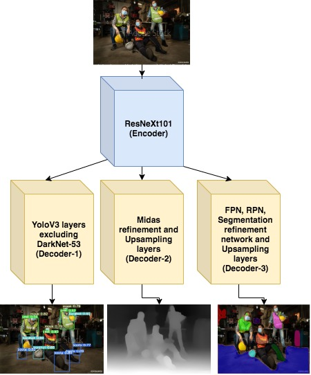
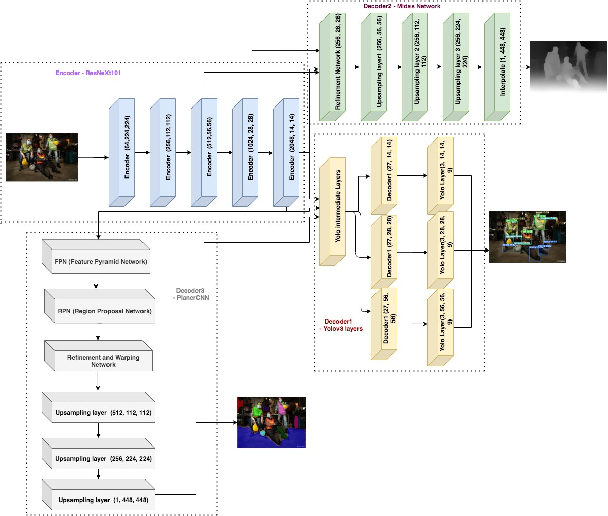

**Data Collection:**

We are solving 3 different problems (Bounding box prediciton, Depthmap, and Planer surfaces detections) through single multi objective model. For object detection we collected images of workers who are wearing vest, hard-hat, mask and boots (3500 images approximately). But this data is not enough to train for depthmap and planer surfaces prediction. So we collected even more data of house interior images from youtube videos. Here the challenge is collecting images should have only interior objects without human beings.

So we filtered the collected images using maskRCNN object predition which trained on coco dataset of 80 classes. If it detects any person object in the image, it will delete that image from collected images.

**Following steps taken to filter out the images:**

- Prepare 5000+ images for Midas and PlanerRCNN:
    - Automated below steps
        - Collected Interior locations related videos youtube links (manual)
        - Installed youtube-dl
        - Installed Detectron2 and dependencies 
        - Downloaded all youtube videos through youtube-dl
        - Extracted the frames for every second
        - Deleted the frames/images which are “having person” or “no objects yet all” by detecting through detectron2 using maskRCNN model
        - Copied all filtered images to target location.      

**Model Architecture:**

To create multi objective model, we considered 3 different models to merge.

    1) YoloV3
    2) Midas from Intel
    3) PlanerCNN from Nvidia
    
And to solve this kind of complex problem, we need to create encoder-decoder architecture. So we created one-encoder and multi-decoder architecture. Above 3 model network architectures has different backbones except Midas and PlanerCNN has common backbone ResNeXt101 & YoloV3 is having DarkNet-53 as backbone.

**Our high level design approach:**

    A) Encoder - ResNeXt101
    B) Created 3 decoders from corresponding layers of 
        1) YOLOv3 excluding darknet
        2) Refinement & upsampling layers of Midas 
        3) FPN(Feature Pyramid Network), RPN(Region proposal network), Segmentation refinement network & Upsampling layers
        
<p align="center">
  
</p>

**Our detailed low level design architecture:**

The inputs and the outputs are of same resolution for depthmaps and surface planes prediction and thus the model has an encoder-decoder architecture, where the model takes one input image  and returns three outputs 

```
a) Object's Boundingbox & it's class, 
b) Depth Map and 
c) Suface Plane. 
```

The input image is first processed through encoder block ResNeXt101, which in turn reduces their size to 52x52, 26x26, 13x13 at the last 3 layers. And these layer outputs directly processed through the intermediate layers of yolov3 to get yolov3 final outputs with shapes a) 27x52x52 b) 27x26x26 c) 27x13x13 given the input shapes are 3x416x416. 

And we use the same reduced outputs with shapes 52x52, 26x26 and 13x13 for getting depth and surface plane outputs. To generate depthmap outputs, we pass these outputs through refinement layers of Midas and then upsample using interpolation layers and get the depth map output with shape which is same as input shape 1x416x416. 

To generate surface plane, we pass the same encoder (ResNext101) outputs mentioned above will be passed to FPN (Feature Pyramid network), RPN (Region proposal network), Refinement Network and Upsampling layers of PlanerCNN.

**1) Integration of Encoder ResNeXt101 to Decoder-1 (YoloV3)**
    
    - Extract 3 outputs from last 3 blocks of ResNeXt101's last layers from corresponding blocks
    - Pass 3 outputs as input to the YOLO intermediate layers which connects the final output layer of YOLOv3.
    - Yolo produces 3 outputs. Ex: If the input size is 3x416x416 with 4 target classes then outputs of yolov3 of shapes will be a) 27x52x52 b) 27x26x26 c) 27x13x13
    - Re-arrange yolo outputs to a) 3x52x52x9, b) 3x26x26x9, c) 3x13x13x9
    - Filter above outputs through non-max suppression to get the final outputs
    - To filter further, during detection, we can give the inputs a) confidence threshold and b) iou threshold as --conf-thres <value> --iou-thres <value> Ex: --conf-thres 0.1 --iou-thres 0.6
    
**2) Integration of Encoder ResNeXt101 to Decoder-2 (Midas)**

    - Extract 3 outputs from last 3 blocks of ResNeXt101's last layers from corresponding blocks
    - Pass above outputs through Midas refinement blocks and get refinement outputs.
    - Pass the refinement outputs through upsampling blocks and get final depthmap outputs with shape match input shape.
    - While writing depth images, we need to make sure they are valid images with pixel values in acceptable range. So we apply following formula to get valid images. 
    ```
    depth_min = depth.min()
    depth_max = depth.max()

    max_val = (2**(8*bits))-1

    if depth_max - depth_min > np.finfo("float").eps:
        out = max_val * (depth - depth_min) / (depth_max - depth_min)
    else:
        out = np.zeros(depth.shape, dtype=depth.type)
    ```
    

**3) Integration of Encoder ResNeXt101 to Decoder-3 (PlanerCNN)**

    - Extract 3 outputs from last 3 blocks of ResNeXt101's last layers from corresponding blocks
    - Pass above outputs through FPN (Feature pyramid network) and get FPN outputs.
    - Pass FPN outputs through RPN (region proposal network) and get RPN outputs.
    - Pass RPN outputs through refinement network to get better segmentation outputs.
    - Pass Segmentation outputs through Upsampling layers and get final surface plane outputs. 
    - We get following outputs from the model
    ```
    1. rpn_class_logits, 
    2. rpn_pred_bbox, 
    3. target_class_ids, 
    4. mrcnn_class_logits, 
    5. target_deltas, 
    6. mrcnn_bbox, 
    7. target_mask, 
    8. mrcnn_mask, 
    9. target_parameters, 
    10. mrcnn_parameters, 
    11. detections, 
    12. detection_masks, 
    13. detection_gt_parameters, 
    14. detection_gt_masks, 
    15. rpn_rois, 
    16. roi_features, 
    17. roi_indices, 
    18. feature_map, 
    19. depth_np_pred
    ```
**Model detailed architecture diagram:

<p align="center">
  
</p>

**YMP (Yolov3, Midas and PlanerCNN) Net Model Summary for input image shape 3x448x448:**

```
----------------------------------------------------------------
        Layer (type)               Output Shape         Param #
================================================================
            Conv2d-1         [-1, 64, 224, 224]           9,408
       BatchNorm2d-2         [-1, 64, 224, 224]             128
              ReLU-3         [-1, 64, 224, 224]               0
         MaxPool2d-4         [-1, 64, 112, 112]               0
            Conv2d-5        [-1, 256, 112, 112]          16,384
       BatchNorm2d-6        [-1, 256, 112, 112]             512
              ReLU-7        [-1, 256, 112, 112]               0
            Conv2d-8        [-1, 256, 112, 112]          18,432
       BatchNorm2d-9        [-1, 256, 112, 112]             512
             ReLU-10        [-1, 256, 112, 112]               0
           Conv2d-11        [-1, 256, 112, 112]          65,536
      BatchNorm2d-12        [-1, 256, 112, 112]             512
           Conv2d-13        [-1, 256, 112, 112]          16,384
      BatchNorm2d-14        [-1, 256, 112, 112]             512
             ReLU-15        [-1, 256, 112, 112]               0
       Bottleneck-16        [-1, 256, 112, 112]               0
           Conv2d-17        [-1, 256, 112, 112]          65,536
      BatchNorm2d-18        [-1, 256, 112, 112]             512
             ReLU-19        [-1, 256, 112, 112]               0
           Conv2d-20        [-1, 256, 112, 112]          18,432
      BatchNorm2d-21        [-1, 256, 112, 112]             512
             ReLU-22        [-1, 256, 112, 112]               0
           Conv2d-23        [-1, 256, 112, 112]          65,536
      BatchNorm2d-24        [-1, 256, 112, 112]             512
             ReLU-25        [-1, 256, 112, 112]               0
       Bottleneck-26        [-1, 256, 112, 112]               0
           Conv2d-27        [-1, 256, 112, 112]          65,536
      BatchNorm2d-28        [-1, 256, 112, 112]             512
             ReLU-29        [-1, 256, 112, 112]               0
           Conv2d-30        [-1, 256, 112, 112]          18,432
      BatchNorm2d-31        [-1, 256, 112, 112]             512
             ReLU-32        [-1, 256, 112, 112]               0
           Conv2d-33        [-1, 256, 112, 112]          65,536
      BatchNorm2d-34        [-1, 256, 112, 112]             512
             ReLU-35        [-1, 256, 112, 112]               0
       Bottleneck-36        [-1, 256, 112, 112]               0
           Conv2d-37        [-1, 512, 112, 112]         131,072
      BatchNorm2d-38        [-1, 512, 112, 112]           1,024
             ReLU-39        [-1, 512, 112, 112]               0
           Conv2d-40          [-1, 512, 56, 56]          73,728
      BatchNorm2d-41          [-1, 512, 56, 56]           1,024
             ReLU-42          [-1, 512, 56, 56]               0
           Conv2d-43          [-1, 512, 56, 56]         262,144
      BatchNorm2d-44          [-1, 512, 56, 56]           1,024
           Conv2d-45          [-1, 512, 56, 56]         131,072
      BatchNorm2d-46          [-1, 512, 56, 56]           1,024
             ReLU-47          [-1, 512, 56, 56]               0
       Bottleneck-48          [-1, 512, 56, 56]               0
           Conv2d-49          [-1, 512, 56, 56]         262,144
      BatchNorm2d-50          [-1, 512, 56, 56]           1,024
             ReLU-51          [-1, 512, 56, 56]               0
           Conv2d-52          [-1, 512, 56, 56]          73,728
      BatchNorm2d-53          [-1, 512, 56, 56]           1,024
             ReLU-54          [-1, 512, 56, 56]               0
           Conv2d-55          [-1, 512, 56, 56]         262,144
      BatchNorm2d-56          [-1, 512, 56, 56]           1,024
             ReLU-57          [-1, 512, 56, 56]               0
       Bottleneck-58          [-1, 512, 56, 56]               0
           Conv2d-59          [-1, 512, 56, 56]         262,144
      BatchNorm2d-60          [-1, 512, 56, 56]           1,024
             ReLU-61          [-1, 512, 56, 56]               0
           Conv2d-62          [-1, 512, 56, 56]          73,728
      BatchNorm2d-63          [-1, 512, 56, 56]           1,024
             ReLU-64          [-1, 512, 56, 56]               0
           Conv2d-65          [-1, 512, 56, 56]         262,144
      BatchNorm2d-66          [-1, 512, 56, 56]           1,024
             ReLU-67          [-1, 512, 56, 56]               0
       Bottleneck-68          [-1, 512, 56, 56]               0
           Conv2d-69          [-1, 512, 56, 56]         262,144
      BatchNorm2d-70          [-1, 512, 56, 56]           1,024
             ReLU-71          [-1, 512, 56, 56]               0
           Conv2d-72          [-1, 512, 56, 56]          73,728
      BatchNorm2d-73          [-1, 512, 56, 56]           1,024
             ReLU-74          [-1, 512, 56, 56]               0
           Conv2d-75          [-1, 512, 56, 56]         262,144
      BatchNorm2d-76          [-1, 512, 56, 56]           1,024
             ReLU-77          [-1, 512, 56, 56]               0
       Bottleneck-78          [-1, 512, 56, 56]               0
           Conv2d-79         [-1, 1024, 56, 56]         524,288
      BatchNorm2d-80         [-1, 1024, 56, 56]           2,048
             ReLU-81         [-1, 1024, 56, 56]               0
           Conv2d-82         [-1, 1024, 28, 28]         294,912
      BatchNorm2d-83         [-1, 1024, 28, 28]           2,048
             ReLU-84         [-1, 1024, 28, 28]               0
           Conv2d-85         [-1, 1024, 28, 28]       1,048,576
      BatchNorm2d-86         [-1, 1024, 28, 28]           2,048
           Conv2d-87         [-1, 1024, 28, 28]         524,288
      BatchNorm2d-88         [-1, 1024, 28, 28]           2,048
             ReLU-89         [-1, 1024, 28, 28]               0
       Bottleneck-90         [-1, 1024, 28, 28]               0
           Conv2d-91         [-1, 1024, 28, 28]       1,048,576
      BatchNorm2d-92         [-1, 1024, 28, 28]           2,048
             ReLU-93         [-1, 1024, 28, 28]               0
           Conv2d-94         [-1, 1024, 28, 28]         294,912
      BatchNorm2d-95         [-1, 1024, 28, 28]           2,048
             ReLU-96         [-1, 1024, 28, 28]               0
           Conv2d-97         [-1, 1024, 28, 28]       1,048,576
      BatchNorm2d-98         [-1, 1024, 28, 28]           2,048
             ReLU-99         [-1, 1024, 28, 28]               0
      Bottleneck-100         [-1, 1024, 28, 28]               0
          Conv2d-101         [-1, 1024, 28, 28]       1,048,576
     BatchNorm2d-102         [-1, 1024, 28, 28]           2,048
            ReLU-103         [-1, 1024, 28, 28]               0
          Conv2d-104         [-1, 1024, 28, 28]         294,912
     BatchNorm2d-105         [-1, 1024, 28, 28]           2,048
            ReLU-106         [-1, 1024, 28, 28]               0
          Conv2d-107         [-1, 1024, 28, 28]       1,048,576
     BatchNorm2d-108         [-1, 1024, 28, 28]           2,048
            ReLU-109         [-1, 1024, 28, 28]               0
      Bottleneck-110         [-1, 1024, 28, 28]               0
          Conv2d-111         [-1, 1024, 28, 28]       1,048,576
     BatchNorm2d-112         [-1, 1024, 28, 28]           2,048
            ReLU-113         [-1, 1024, 28, 28]               0
          Conv2d-114         [-1, 1024, 28, 28]         294,912
     BatchNorm2d-115         [-1, 1024, 28, 28]           2,048
            ReLU-116         [-1, 1024, 28, 28]               0
          Conv2d-117         [-1, 1024, 28, 28]       1,048,576
     BatchNorm2d-118         [-1, 1024, 28, 28]           2,048
            ReLU-119         [-1, 1024, 28, 28]               0
      Bottleneck-120         [-1, 1024, 28, 28]               0
          Conv2d-121         [-1, 1024, 28, 28]       1,048,576
     BatchNorm2d-122         [-1, 1024, 28, 28]           2,048
            ReLU-123         [-1, 1024, 28, 28]               0
          Conv2d-124         [-1, 1024, 28, 28]         294,912
     BatchNorm2d-125         [-1, 1024, 28, 28]           2,048
            ReLU-126         [-1, 1024, 28, 28]               0
          Conv2d-127         [-1, 1024, 28, 28]       1,048,576
     BatchNorm2d-128         [-1, 1024, 28, 28]           2,048
            ReLU-129         [-1, 1024, 28, 28]               0
      Bottleneck-130         [-1, 1024, 28, 28]               0
          Conv2d-131         [-1, 1024, 28, 28]       1,048,576
     BatchNorm2d-132         [-1, 1024, 28, 28]           2,048
            ReLU-133         [-1, 1024, 28, 28]               0
          Conv2d-134         [-1, 1024, 28, 28]         294,912
     BatchNorm2d-135         [-1, 1024, 28, 28]           2,048
            ReLU-136         [-1, 1024, 28, 28]               0
          Conv2d-137         [-1, 1024, 28, 28]       1,048,576
     BatchNorm2d-138         [-1, 1024, 28, 28]           2,048
            ReLU-139         [-1, 1024, 28, 28]               0
      Bottleneck-140         [-1, 1024, 28, 28]               0
          Conv2d-141         [-1, 1024, 28, 28]       1,048,576
     BatchNorm2d-142         [-1, 1024, 28, 28]           2,048
            ReLU-143         [-1, 1024, 28, 28]               0
          Conv2d-144         [-1, 1024, 28, 28]         294,912
     BatchNorm2d-145         [-1, 1024, 28, 28]           2,048
            ReLU-146         [-1, 1024, 28, 28]               0
          Conv2d-147         [-1, 1024, 28, 28]       1,048,576
     BatchNorm2d-148         [-1, 1024, 28, 28]           2,048
            ReLU-149         [-1, 1024, 28, 28]               0
      Bottleneck-150         [-1, 1024, 28, 28]               0
          Conv2d-151         [-1, 1024, 28, 28]       1,048,576
     BatchNorm2d-152         [-1, 1024, 28, 28]           2,048
            ReLU-153         [-1, 1024, 28, 28]               0
          Conv2d-154         [-1, 1024, 28, 28]         294,912
     BatchNorm2d-155         [-1, 1024, 28, 28]           2,048
            ReLU-156         [-1, 1024, 28, 28]               0
          Conv2d-157         [-1, 1024, 28, 28]       1,048,576
     BatchNorm2d-158         [-1, 1024, 28, 28]           2,048
            ReLU-159         [-1, 1024, 28, 28]               0
      Bottleneck-160         [-1, 1024, 28, 28]               0
          Conv2d-161         [-1, 1024, 28, 28]       1,048,576
     BatchNorm2d-162         [-1, 1024, 28, 28]           2,048
            ReLU-163         [-1, 1024, 28, 28]               0
          Conv2d-164         [-1, 1024, 28, 28]         294,912
     BatchNorm2d-165         [-1, 1024, 28, 28]           2,048
            ReLU-166         [-1, 1024, 28, 28]               0
          Conv2d-167         [-1, 1024, 28, 28]       1,048,576
     BatchNorm2d-168         [-1, 1024, 28, 28]           2,048
            ReLU-169         [-1, 1024, 28, 28]               0
      Bottleneck-170         [-1, 1024, 28, 28]               0
          Conv2d-171         [-1, 1024, 28, 28]       1,048,576
     BatchNorm2d-172         [-1, 1024, 28, 28]           2,048
            ReLU-173         [-1, 1024, 28, 28]               0
          Conv2d-174         [-1, 1024, 28, 28]         294,912
     BatchNorm2d-175         [-1, 1024, 28, 28]           2,048
            ReLU-176         [-1, 1024, 28, 28]               0
          Conv2d-177         [-1, 1024, 28, 28]       1,048,576
     BatchNorm2d-178         [-1, 1024, 28, 28]           2,048
            ReLU-179         [-1, 1024, 28, 28]               0
      Bottleneck-180         [-1, 1024, 28, 28]               0
          Conv2d-181         [-1, 1024, 28, 28]       1,048,576
     BatchNorm2d-182         [-1, 1024, 28, 28]           2,048
            ReLU-183         [-1, 1024, 28, 28]               0
          Conv2d-184         [-1, 1024, 28, 28]         294,912
     BatchNorm2d-185         [-1, 1024, 28, 28]           2,048
            ReLU-186         [-1, 1024, 28, 28]               0
          Conv2d-187         [-1, 1024, 28, 28]       1,048,576
     BatchNorm2d-188         [-1, 1024, 28, 28]           2,048
            ReLU-189         [-1, 1024, 28, 28]               0
      Bottleneck-190         [-1, 1024, 28, 28]               0
          Conv2d-191         [-1, 1024, 28, 28]       1,048,576
     BatchNorm2d-192         [-1, 1024, 28, 28]           2,048
            ReLU-193         [-1, 1024, 28, 28]               0
          Conv2d-194         [-1, 1024, 28, 28]         294,912
     BatchNorm2d-195         [-1, 1024, 28, 28]           2,048
            ReLU-196         [-1, 1024, 28, 28]               0
          Conv2d-197         [-1, 1024, 28, 28]       1,048,576
     BatchNorm2d-198         [-1, 1024, 28, 28]           2,048
            ReLU-199         [-1, 1024, 28, 28]               0
      Bottleneck-200         [-1, 1024, 28, 28]               0
          Conv2d-201         [-1, 1024, 28, 28]       1,048,576
     BatchNorm2d-202         [-1, 1024, 28, 28]           2,048
            ReLU-203         [-1, 1024, 28, 28]               0
          Conv2d-204         [-1, 1024, 28, 28]         294,912
     BatchNorm2d-205         [-1, 1024, 28, 28]           2,048
            ReLU-206         [-1, 1024, 28, 28]               0
          Conv2d-207         [-1, 1024, 28, 28]       1,048,576
     BatchNorm2d-208         [-1, 1024, 28, 28]           2,048
            ReLU-209         [-1, 1024, 28, 28]               0
      Bottleneck-210         [-1, 1024, 28, 28]               0
          Conv2d-211         [-1, 1024, 28, 28]       1,048,576
     BatchNorm2d-212         [-1, 1024, 28, 28]           2,048
            ReLU-213         [-1, 1024, 28, 28]               0
          Conv2d-214         [-1, 1024, 28, 28]         294,912
     BatchNorm2d-215         [-1, 1024, 28, 28]           2,048
            ReLU-216         [-1, 1024, 28, 28]               0
          Conv2d-217         [-1, 1024, 28, 28]       1,048,576
     BatchNorm2d-218         [-1, 1024, 28, 28]           2,048
            ReLU-219         [-1, 1024, 28, 28]               0
      Bottleneck-220         [-1, 1024, 28, 28]               0
          Conv2d-221         [-1, 1024, 28, 28]       1,048,576
     BatchNorm2d-222         [-1, 1024, 28, 28]           2,048
            ReLU-223         [-1, 1024, 28, 28]               0
          Conv2d-224         [-1, 1024, 28, 28]         294,912
     BatchNorm2d-225         [-1, 1024, 28, 28]           2,048
            ReLU-226         [-1, 1024, 28, 28]               0
          Conv2d-227         [-1, 1024, 28, 28]       1,048,576
     BatchNorm2d-228         [-1, 1024, 28, 28]           2,048
            ReLU-229         [-1, 1024, 28, 28]               0
      Bottleneck-230         [-1, 1024, 28, 28]               0
          Conv2d-231         [-1, 1024, 28, 28]       1,048,576
     BatchNorm2d-232         [-1, 1024, 28, 28]           2,048
            ReLU-233         [-1, 1024, 28, 28]               0
          Conv2d-234         [-1, 1024, 28, 28]         294,912
     BatchNorm2d-235         [-1, 1024, 28, 28]           2,048
            ReLU-236         [-1, 1024, 28, 28]               0
          Conv2d-237         [-1, 1024, 28, 28]       1,048,576
     BatchNorm2d-238         [-1, 1024, 28, 28]           2,048
            ReLU-239         [-1, 1024, 28, 28]               0
      Bottleneck-240         [-1, 1024, 28, 28]               0
          Conv2d-241         [-1, 1024, 28, 28]       1,048,576
     BatchNorm2d-242         [-1, 1024, 28, 28]           2,048
            ReLU-243         [-1, 1024, 28, 28]               0
          Conv2d-244         [-1, 1024, 28, 28]         294,912
     BatchNorm2d-245         [-1, 1024, 28, 28]           2,048
            ReLU-246         [-1, 1024, 28, 28]               0
          Conv2d-247         [-1, 1024, 28, 28]       1,048,576
     BatchNorm2d-248         [-1, 1024, 28, 28]           2,048
            ReLU-249         [-1, 1024, 28, 28]               0
      Bottleneck-250         [-1, 1024, 28, 28]               0
          Conv2d-251         [-1, 1024, 28, 28]       1,048,576
     BatchNorm2d-252         [-1, 1024, 28, 28]           2,048
            ReLU-253         [-1, 1024, 28, 28]               0
          Conv2d-254         [-1, 1024, 28, 28]         294,912
     BatchNorm2d-255         [-1, 1024, 28, 28]           2,048
            ReLU-256         [-1, 1024, 28, 28]               0
          Conv2d-257         [-1, 1024, 28, 28]       1,048,576
     BatchNorm2d-258         [-1, 1024, 28, 28]           2,048
            ReLU-259         [-1, 1024, 28, 28]               0
      Bottleneck-260         [-1, 1024, 28, 28]               0
          Conv2d-261         [-1, 1024, 28, 28]       1,048,576
     BatchNorm2d-262         [-1, 1024, 28, 28]           2,048
            ReLU-263         [-1, 1024, 28, 28]               0
          Conv2d-264         [-1, 1024, 28, 28]         294,912
     BatchNorm2d-265         [-1, 1024, 28, 28]           2,048
            ReLU-266         [-1, 1024, 28, 28]               0
          Conv2d-267         [-1, 1024, 28, 28]       1,048,576
     BatchNorm2d-268         [-1, 1024, 28, 28]           2,048
            ReLU-269         [-1, 1024, 28, 28]               0
      Bottleneck-270         [-1, 1024, 28, 28]               0
          Conv2d-271         [-1, 1024, 28, 28]       1,048,576
     BatchNorm2d-272         [-1, 1024, 28, 28]           2,048
            ReLU-273         [-1, 1024, 28, 28]               0
          Conv2d-274         [-1, 1024, 28, 28]         294,912
     BatchNorm2d-275         [-1, 1024, 28, 28]           2,048
            ReLU-276         [-1, 1024, 28, 28]               0
          Conv2d-277         [-1, 1024, 28, 28]       1,048,576
     BatchNorm2d-278         [-1, 1024, 28, 28]           2,048
            ReLU-279         [-1, 1024, 28, 28]               0
      Bottleneck-280         [-1, 1024, 28, 28]               0
          Conv2d-281         [-1, 1024, 28, 28]       1,048,576
     BatchNorm2d-282         [-1, 1024, 28, 28]           2,048
            ReLU-283         [-1, 1024, 28, 28]               0
          Conv2d-284         [-1, 1024, 28, 28]         294,912
     BatchNorm2d-285         [-1, 1024, 28, 28]           2,048
            ReLU-286         [-1, 1024, 28, 28]               0
          Conv2d-287         [-1, 1024, 28, 28]       1,048,576
     BatchNorm2d-288         [-1, 1024, 28, 28]           2,048
            ReLU-289         [-1, 1024, 28, 28]               0
      Bottleneck-290         [-1, 1024, 28, 28]               0
          Conv2d-291         [-1, 1024, 28, 28]       1,048,576
     BatchNorm2d-292         [-1, 1024, 28, 28]           2,048
            ReLU-293         [-1, 1024, 28, 28]               0
          Conv2d-294         [-1, 1024, 28, 28]         294,912
     BatchNorm2d-295         [-1, 1024, 28, 28]           2,048
            ReLU-296         [-1, 1024, 28, 28]               0
          Conv2d-297         [-1, 1024, 28, 28]       1,048,576
     BatchNorm2d-298         [-1, 1024, 28, 28]           2,048
            ReLU-299         [-1, 1024, 28, 28]               0
      Bottleneck-300         [-1, 1024, 28, 28]               0
          Conv2d-301         [-1, 1024, 28, 28]       1,048,576
     BatchNorm2d-302         [-1, 1024, 28, 28]           2,048
            ReLU-303         [-1, 1024, 28, 28]               0
          Conv2d-304         [-1, 1024, 28, 28]         294,912
     BatchNorm2d-305         [-1, 1024, 28, 28]           2,048
            ReLU-306         [-1, 1024, 28, 28]               0
          Conv2d-307         [-1, 1024, 28, 28]       1,048,576
     BatchNorm2d-308         [-1, 1024, 28, 28]           2,048
            ReLU-309         [-1, 1024, 28, 28]               0
      Bottleneck-310         [-1, 1024, 28, 28]               0
          Conv2d-311         [-1, 2048, 28, 28]       2,097,152
     BatchNorm2d-312         [-1, 2048, 28, 28]           4,096
            ReLU-313         [-1, 2048, 28, 28]               0
          Conv2d-314         [-1, 2048, 14, 14]       1,179,648
     BatchNorm2d-315         [-1, 2048, 14, 14]           4,096
            ReLU-316         [-1, 2048, 14, 14]               0
          Conv2d-317         [-1, 2048, 14, 14]       4,194,304
     BatchNorm2d-318         [-1, 2048, 14, 14]           4,096
          Conv2d-319         [-1, 2048, 14, 14]       2,097,152
     BatchNorm2d-320         [-1, 2048, 14, 14]           4,096
            ReLU-321         [-1, 2048, 14, 14]               0
      Bottleneck-322         [-1, 2048, 14, 14]               0
          Conv2d-323         [-1, 2048, 14, 14]       4,194,304
     BatchNorm2d-324         [-1, 2048, 14, 14]           4,096
            ReLU-325         [-1, 2048, 14, 14]               0
          Conv2d-326         [-1, 2048, 14, 14]       1,179,648
     BatchNorm2d-327         [-1, 2048, 14, 14]           4,096
            ReLU-328         [-1, 2048, 14, 14]               0
          Conv2d-329         [-1, 2048, 14, 14]       4,194,304
     BatchNorm2d-330         [-1, 2048, 14, 14]           4,096
            ReLU-331         [-1, 2048, 14, 14]               0
      Bottleneck-332         [-1, 2048, 14, 14]               0
          Conv2d-333         [-1, 2048, 14, 14]       4,194,304
     BatchNorm2d-334         [-1, 2048, 14, 14]           4,096
            ReLU-335         [-1, 2048, 14, 14]               0
          Conv2d-336         [-1, 2048, 14, 14]       1,179,648
     BatchNorm2d-337         [-1, 2048, 14, 14]           4,096
            ReLU-338         [-1, 2048, 14, 14]               0
          Conv2d-339         [-1, 2048, 14, 14]       4,194,304
     BatchNorm2d-340         [-1, 2048, 14, 14]           4,096
            ReLU-341         [-1, 2048, 14, 14]               0
      Bottleneck-342         [-1, 2048, 14, 14]               0
          Conv2d-343        [-1, 256, 112, 112]         589,824
          Conv2d-344          [-1, 256, 56, 56]       1,179,648
          Conv2d-345          [-1, 256, 28, 28]       2,359,296
          Conv2d-346          [-1, 256, 14, 14]       4,718,592
            ReLU-347          [-1, 256, 14, 14]               0
          Conv2d-348          [-1, 256, 14, 14]         590,080
            ReLU-349          [-1, 256, 14, 14]               0
          Conv2d-350          [-1, 256, 14, 14]         590,080
ResidualConvUnit-351          [-1, 256, 14, 14]               0
FeatureFusionBlock-352          [-1, 256, 28, 28]               0
            ReLU-353          [-1, 256, 28, 28]               0
          Conv2d-354          [-1, 256, 28, 28]         590,080
            ReLU-355          [-1, 256, 28, 28]               0
          Conv2d-356          [-1, 256, 28, 28]         590,080
ResidualConvUnit-357          [-1, 256, 28, 28]               0
            ReLU-358          [-1, 256, 28, 28]               0
          Conv2d-359          [-1, 256, 28, 28]         590,080
            ReLU-360          [-1, 256, 28, 28]               0
          Conv2d-361          [-1, 256, 28, 28]         590,080
ResidualConvUnit-362          [-1, 256, 28, 28]               0
FeatureFusionBlock-363          [-1, 256, 56, 56]               0
            ReLU-364          [-1, 256, 56, 56]               0
          Conv2d-365          [-1, 256, 56, 56]         590,080
            ReLU-366          [-1, 256, 56, 56]               0
          Conv2d-367          [-1, 256, 56, 56]         590,080
ResidualConvUnit-368          [-1, 256, 56, 56]               0
            ReLU-369          [-1, 256, 56, 56]               0
          Conv2d-370          [-1, 256, 56, 56]         590,080
            ReLU-371          [-1, 256, 56, 56]               0
          Conv2d-372          [-1, 256, 56, 56]         590,080
ResidualConvUnit-373          [-1, 256, 56, 56]               0
FeatureFusionBlock-374        [-1, 256, 112, 112]               0
            ReLU-375        [-1, 256, 112, 112]               0
          Conv2d-376        [-1, 256, 112, 112]         590,080
            ReLU-377        [-1, 256, 112, 112]               0
          Conv2d-378        [-1, 256, 112, 112]         590,080
ResidualConvUnit-379        [-1, 256, 112, 112]               0
            ReLU-380        [-1, 256, 112, 112]               0
          Conv2d-381        [-1, 256, 112, 112]         590,080
            ReLU-382        [-1, 256, 112, 112]               0
          Conv2d-383        [-1, 256, 112, 112]         590,080
ResidualConvUnit-384        [-1, 256, 112, 112]               0
FeatureFusionBlock-385        [-1, 256, 224, 224]               0
          Conv2d-386        [-1, 128, 224, 224]         295,040
     Interpolate-387        [-1, 128, 448, 448]               0
          Conv2d-388         [-1, 32, 448, 448]          36,896
            ReLU-389         [-1, 32, 448, 448]               0
          Conv2d-390          [-1, 1, 448, 448]              33
            ReLU-391          [-1, 1, 448, 448]               0
          Conv2d-392        [-1, 256, 224, 224]           6,912
     BatchNorm2d-393        [-1, 256, 224, 224]             512
            ReLU-394        [-1, 256, 224, 224]               0
          Conv2d-395        [-1, 256, 112, 112]         589,824
     BatchNorm2d-396        [-1, 256, 112, 112]             512
            ReLU-397        [-1, 256, 112, 112]               0
          Conv2d-398          [-1, 256, 56, 56]         589,824
     BatchNorm2d-399          [-1, 256, 56, 56]             512
            ReLU-400          [-1, 256, 56, 56]               0
          Conv2d-401          [-1, 512, 28, 28]       1,179,648
     BatchNorm2d-402          [-1, 512, 28, 28]           1,024
            ReLU-403          [-1, 512, 28, 28]               0
          Conv2d-404         [-1, 1024, 14, 14]       4,718,592
     BatchNorm2d-405         [-1, 1024, 14, 14]           2,048
            ReLU-406         [-1, 1024, 14, 14]               0
          Conv2d-407         [-1, 1024, 14, 14]       2,097,152
     BatchNorm2d-408         [-1, 1024, 14, 14]           2,048
            ReLU-409         [-1, 1024, 14, 14]               0
          Conv2d-410           [-1, 27, 14, 14]          27,675
       YOLOLayer-411         [-1, 3, 14, 14, 9]               0
     Interpolate-412         [-1, 1024, 28, 28]               0
          Conv2d-413          [-1, 256, 28, 28]         262,144
     BatchNorm2d-414          [-1, 256, 28, 28]             512
            ReLU-415          [-1, 256, 28, 28]               0
          Conv2d-416          [-1, 512, 28, 28]         524,288
     BatchNorm2d-417          [-1, 512, 28, 28]           1,024
            ReLU-418          [-1, 512, 28, 28]               0
          Conv2d-419          [-1, 256, 28, 28]         196,608
     BatchNorm2d-420          [-1, 256, 28, 28]             512
            ReLU-421          [-1, 256, 28, 28]               0
          Conv2d-422          [-1, 512, 28, 28]       1,179,648
     BatchNorm2d-423          [-1, 512, 28, 28]           1,024
            ReLU-424          [-1, 512, 28, 28]               0
          Conv2d-425          [-1, 256, 28, 28]         131,072
     BatchNorm2d-426          [-1, 256, 28, 28]             512
            ReLU-427          [-1, 256, 28, 28]               0
          Conv2d-428          [-1, 512, 28, 28]       1,179,648
     BatchNorm2d-429          [-1, 512, 28, 28]           1,024
            ReLU-430          [-1, 512, 28, 28]               0
          Conv2d-431          [-1, 256, 28, 28]         131,072
     BatchNorm2d-432          [-1, 256, 28, 28]             512
            ReLU-433          [-1, 256, 28, 28]               0
          Conv2d-434          [-1, 512, 28, 28]       1,179,648
     BatchNorm2d-435          [-1, 512, 28, 28]           1,024
            ReLU-436          [-1, 512, 28, 28]               0
          Conv2d-437           [-1, 27, 28, 28]          13,851
       YOLOLayer-438         [-1, 3, 28, 28, 9]               0
          Conv2d-439          [-1, 256, 56, 56]         131,072
     BatchNorm2d-440          [-1, 256, 56, 56]             512
            ReLU-441          [-1, 256, 56, 56]               0
     Interpolate-442          [-1, 512, 56, 56]               0
          Conv2d-443          [-1, 128, 56, 56]          65,536
     BatchNorm2d-444          [-1, 128, 56, 56]             256
            ReLU-445          [-1, 128, 56, 56]               0
          Conv2d-446          [-1, 128, 56, 56]          49,152
     BatchNorm2d-447          [-1, 128, 56, 56]             256
            ReLU-448          [-1, 128, 56, 56]               0
          Conv2d-449          [-1, 256, 56, 56]         294,912
     BatchNorm2d-450          [-1, 256, 56, 56]             512
            ReLU-451          [-1, 256, 56, 56]               0
          Conv2d-452          [-1, 128, 56, 56]          32,768
     BatchNorm2d-453          [-1, 128, 56, 56]             256
            ReLU-454          [-1, 128, 56, 56]               0
          Conv2d-455          [-1, 256, 56, 56]         294,912
     BatchNorm2d-456          [-1, 256, 56, 56]             512
            ReLU-457          [-1, 256, 56, 56]               0
          Conv2d-458          [-1, 128, 56, 56]          32,768
     BatchNorm2d-459          [-1, 128, 56, 56]             256
            ReLU-460          [-1, 128, 56, 56]               0
          Conv2d-461          [-1, 256, 56, 56]         294,912
     BatchNorm2d-462          [-1, 256, 56, 56]             512
            ReLU-463          [-1, 256, 56, 56]               0
          Conv2d-464           [-1, 27, 56, 56]           6,939
       YOLOLayer-465         [-1, 3, 56, 56, 9]               0
================================================================
Total params: 119,409,234
Trainable params: 104,182,785
Non-trainable params: 15,226,449
----------------------------------------------------------------
Input size (MB): 2.30
Forward/backward pass size (MB): 4511.99
Params size (MB): 455.51
Estimated Total Size (MB): 4969.80
----------------------------------------------------------------
```

### Multi objective model Losses:

As our model has 3 objectives, and each objective has it's own loss. For yolov3 and PlanerCNN, we didn't change the loss function, we have used as it is that defined by authors of these networks. But for Midas there no loss or training details provided by author. So we came up with our own loss funciton. In midas, the output is depthmap which is an image and we need to compare with it's ground truth image. There are various techniques to compare the images similarities like Peak to Noise ratio, SSIM, MSE, gradient loss etc... But among them SSIM, Gradient loss, and RMSE worked well for us. 

**The Structural Similarity Index (SSIM) Loss**

- SSIM loss will look for similarities within pixels; i.e. if the pixels in the two images line up and or have similar pixel density values.
- **Standardized Values**: SSIM puts everything in a scale of -1 to 1. A score of 1 meant they are very similar and a score of -1 meant they are very different.

**RMSE (Root Mean squared Error) and Gradient loss **

- Compute scale and shift of the pixels of the predicted image
- Calculate the gradient loss with below calculations.
    ```
    diff = prediction - target
    diff = torch.mul(mask, diff)

    grad_x = torch.abs(diff[:, :, 1:] - diff[:, :, :-1])
    mask_x = torch.mul(mask[:, :, 1:], mask[:, :, :-1])
    grad_x = torch.mul(mask_x, grad_x)

    grad_y = torch.abs(diff[:, 1:, :] - diff[:, :-1, :])
    mask_y = torch.mul(mask[:, 1:, :], mask[:, :-1, :])
    grad_y = torch.mul(mask_y, grad_y)

    image_loss = torch.sum(grad_x, (1, 2)) + torch.sum(grad_y, (1, 2))    
    ```
- Calculate RMSE loss between prediciton and target image
```
sqrt(mse_loss(prediction, target, mask, reduction=self.__reduction))
```
- Take weightage summation of RMSE and Gradient loss
```
    rmse_grad_loss = alpha*grad_loss + rmse_loss # Here we used alpha=0.5
```

**Sample losses output during the training:**

```
Epoch          gpu_mem             GIoU              obj              cls            total          targets          ImgSize RmseGradMeanLoss    SSIM_meanLoss
   152/299     14.6G             7             2.42             3.91             19.2               25.53               448               0.042            0.152: 100% 346/346 [02:16<00:00,  1.57s/it]
               Class           Images          Targets                P                R          mAP@0.5               F1 RmseGradientLoss         SSIMLoss            DLoss        TotalLoss: 100% 87/87 [00:12<00:00,  1.81it/s]
                 all              692         3.06e+03                0.23                0.46                0.36356                2.736                           16.9              19.636              19.636
```        
