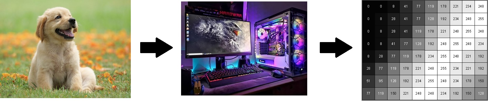
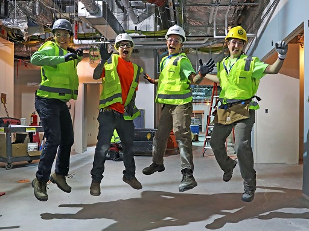
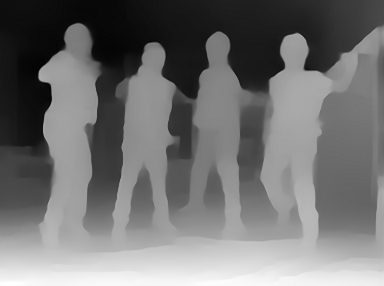
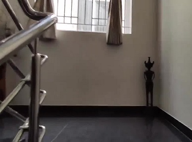
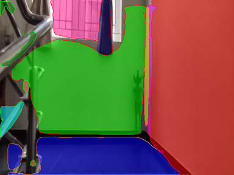

## Sesson 15 - Create a network that can perform 3 tasks simultaneously
1.  Predict the boots, PPE, hardhat, and mask if there is an image
2.  Predict the depth map of the image
3.  Predict the Planar Surfaces in the region

Author: S.A.Ezhirko
**********************************************************************************************************************

Some of the biggest challenges in computer vission is to recognise and identify the objects present in the image, predict the depth between the objects in the image and identify the surface planes in a given image. For many years these task were challenging for researchers because the image seen by computer is just a array of pixel values.

## Application of Object Detection, Depth Estimation and Plane Surface Detection.
Object detection:

 - Object detection is a basic function that is needed in robotic industry to identify the object and perform useful task. 
 - The robot with the help of camera, scans the environment and detects the objects present and obtain its location on the scaned scene.
 - With the help of interested object location in a scene, the robot can choose to perform activities like moving towards it or away from it, picking the object or placing    the object etc.
 
 Depth Estimation:
 
 - Depth estimation is an important function in robotic industry to gathering the disparity among objects present in the given scene.
 - The depth information helps the robot to navigate in a given scene by avoiding colision with the objects, hitting any object, picking any object etc.
 - Based on the shift, scale and disparity information the robot makes the decision that has to be done with the objects present in the scene.
 
 Plane Detection:
 - plane detection technique has been widely used in robot navigation in identifying wall, floor, steps, furniture etc.
 - Depth cameras or LIDAR are used to get the plane segmentation and detect the plane surface.
 - Plane Detection are widely used in Augumented reality application to identify the plane surface and bring in virtual objects into the virtual scene.

In order to achive depth estimation and plane detection, we need expensive equipments like depth camera and LIDAR. But after the possibility of creating and executing Deep Neural Networks in modern world, these problems which was challenging are now able to predict with out expensive hardware involvement. 

In object detection the computer must identify the object of our interest in the given image and mark the bounding box surrounding the identified image.

  
  

In Depth Estimation, the machine has to extract the depth information of the foreground entities from a single image. Example below shows the extracted depth information (on the right) from an image (on the left).

  
  

In Plane Surface Estimation, the machine has to detect the plane surface information from the depth and mask entities from a single image.

  
  

This project explains a neural network model that performs object detection with bounding box prediction, depth estimation and plane surface detection with out using any expensive hardware. This project is divided into two stages.

Stage 1 : Contains a model that is capable of predicting bounding box and depth for a given image.
Stage 2 : Contains a model that is capable of predicting bounding box, depth and plane surface detection.

The reason for spliting into stages is to approach the problem step by step. In the first stage implementation of objection detection using YoloV3 and depth estimation using MIDAS was choosen. Plane surface detection was not choosen to implementation in stage 1 due to complexity and understandability. Below are the stage 1 contents

- [Dataset](docs/dataset.md)

