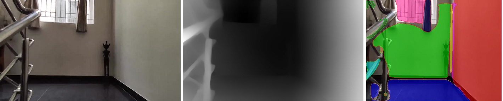
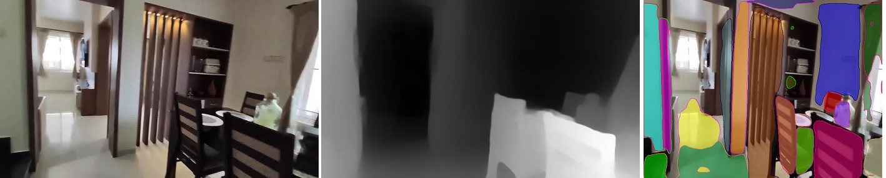
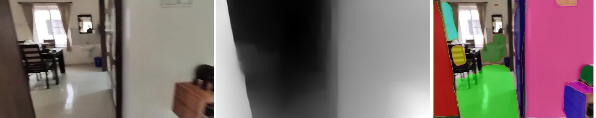

## Sesson 15 - Create a network that can perform 3 tasks simultaneously
1.  Predict the boots, PPE, hardhat, and mask if there is an image
2.  Predict the depth map of the image
3.  Predict the Planar Surfaces in the region

Author: S.A.Ezhirko
**********************************************************************************************************************

Some of the biggest challenges in computer vission is to recognise and identify the objects present in the image, predict the depth between the objects in the image and identify the surface planes in a given image. For many years these task were challenging for researchers because the image seen by computer is just a array of pixel values.

## Application of Object Detection, Depth Estimation and Plane Surface Detection.
Object detection:

 - Object detection is a basic function that is needed in robotic industry to identify the object and perform useful task. 
 - The robot with the help of camera, scans the environment and detects the objects present and obtain its location on the scaned scene.
 - With the help of interested object location in a scene, the robot can choose to perform activities like moving towards it or away from it, picking the object or placing    the object etc.
 
 Depth Estimation:
 
 - Depth estimation is an important function in robotic industry to gathering the disparity among objects present in the given scene.
 - The depth information helps the robot to navigate in a given scene by avoiding colision with the objects, hitting any object, picking any object etc.
 - Based on the shift, scale and disparity information the robot makes the decision that has to be done with the objects present in the scene.
 
 Plane Detection:
 - plane detection technique has been widely used in robot navigation in identifying wall, floor, steps, furniture etc.
 - Depth cameras or LIDAR are used to get the plane segmentation and detect the plane surface.
 - Plane Detection are widely used in Augumented reality application to identify the plane surface and bring in virtual objects into the virtual scene.

In order to achive depth estimation and plane detection, we need expensive equipments like depth camera and LIDAR. But after the possibility of creating and executing Deep Neural Networks in modern world, these problems which was challenging are now able to predict with out expensive hardware involvement. 

In object detection the computer must identify the object of our interest in the given image and mark the bounding box surrounding the identified image.

  
  

In Depth Estimation, the machine has to extract the depth information of the foreground entities from a single image. Example below shows the extracted depth information (on the right) from an image (on the left).

  
  

In Plane Surface Estimation, the machine has to detect the plane surface information from the depth and mask entities from a single image.

  
  

This project explains a neural network model that performs object detection with bounding box prediction, depth estimation and plane surface detection with out using any expensive hardware. This project is divided into two stages.

Stage 1 : Contains a model that is capable of predicting bounding box and depth for a given image. 
Stage 2 : Contains a model that is capable of predicting bounding box, depth and plane surface detection.

The reason for spliting into stages is to approach the problem step by step. In the first stage implementation of objection detection using YoloV3 and depth estimation using MIDAS was choosen. Plane surface detection was not choosen to implementation in stage 1 due to complexity. Below are the stage 1 contents

- [Dataset](dataset.md)
- [Model Architecture](ModelArchitecture.md)
- [Loss Function](LossFunction.md)
  - [Bounding box Prediction](LossFunction.md#bounding-box-prediction)
  - [Depth Predictionn](LossFunction.md#depth-loss-function)
- [Training](training.md)
- [Steps to run](steps.md)

## Stage 2: Implementing Surface detection using PlaneRCNN and integrating it with Stage1 model.

- ### Data collection
  - PPE Dataset contains more of human and their protective gear images. The number of plane surface that could be present in the dataset will be very less.
  - House interior videos from youtube was downloaded using automated script. The script does the following things.
    - Collected Interior locations related videos youtube links (manual)
    - Installed youtube-dl
    - Installed Detectron2 and dependencies 
    - Downloaded all youtube videos through youtube-dl
    - Extracted the frames for every second
    - Deleted the frames/images which are “having person” or “no objects yet all” by detecting through detectron2 using maskRCNN model
   - Refer to the [link](https://github.com/eva5covergence/Ezhirko/blob/main/PlaneSurfaceDetection/plane_surface_data_preparation.ipynb) for automated downloading of videos.
   
   #### Input Image, Ground truth data - Depth map and Plane Segmentation
   

     
   

   

     
   

   

     
   

   
   The entire dataset can be viewed [here](https://drive.google.com/drive/u/0/folders/163knHweJJ5ERXLsedm9ZW3ahWkMzHPSl)
   
   The intension is to try and understand how to train the existing PlaneRCNN model with custom images. Once confidence on training custom image is gained, then integrating it to Stage1 model will be easier. The input images are split into test and train set, written into train.txt and test.txt in the same manner mentioned in the Stage 1 approach. The existing dataloader classes were modifed to take in our custom input image, MIDAS depth image, image_plane_mask.npy and image_plane_parameter.npy and create a dataloader for training the model. The dataloader classes modified can be viewed [here](https://github.com/eva5covergence/Ezhirko/tree/main/PlaneSurfaceDetection/datasets). Please refer to scannet_scene.py and plane_stereo_dataset.py for the modification.
   
- ### Training the model
 - Training the model involves installing old version of torch libraries and building the roi and nms code and then start the training script.
 - While training, training from pre-trained mask-rcnn model weights didnot work and had to start the training from saved checkpoint file.
 - Lot of errors related to depth was thrown during the training and was able to by pass the issue by training the model from scratch and not from saved check point.
 The code for training can be found [here](https://github.com/eva5covergence/Ezhirko/blob/main/PlaneSurfaceDetection/Train_PlaneRCNN.ipynb)

- ### Challenges Observed
 - The dataloader need Plane_info.npy which was completely missing in our dataset. Had to modify lot of code to accomodate its non existence.
 - The segmentation image what we derived out of running the evaluate.py script cannot be used as ground truth for this model.
 - The segmentation image should contain different colors for different planes and black color for non annotated portion of the image. Code was written in the dataloader class to create such a segmentation ground truth for given image using plane_mask.npy. 
 - When tried to integrate with Stage 1 Model, PlaneRCNN started giving torch version issues and could not be integrated successfully.
 
- ### Take aways
 - Learnt to develop Multimodel architecture.
 - Got good knowledge of Encoder and multiple Decoder architecture and challenges involved in integrating.
 - Learnt how to collect sensible data and create data pipeling to model.
 - Realised that we need to choose augumentation statergy that is commonly suitable for all connected decoders.
 - Could have tried the approach of keeping the PlaneRCNN as main branch and Yolo decoder and MIDAS decoder could have been connected to PlaneRCNN Encoder.
 
   
   
   
   
   
   
