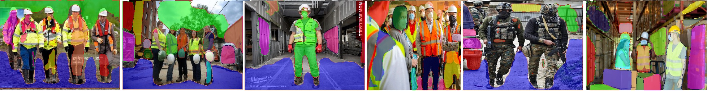

# Dataset

The dataset used for this model is called PPE dataset. This dataset consists of people wearing protective gear like Hardhat, Vest, Mask and Boots. About 3570 number of images of this kind was randomly picked from the internet and was used as input data. For each input image, we have corresponding Bounding box coordinates for 4 classes, Depth image, Surface Plane image, Plane parameters and Plane mask as the ground truth.
 - The bounding box coordinates was created using Yolo annotation tool and the results were saved in a text file.
 - The Depth image was generated from the [MIDAS](https://github.com/intel-isl/MiDaS) network by running the model in evaluation mode and infering the depth output for given image.
 - The Surface Plane image, Plane parameters and Plane mask were again generated by running the pretrained [PlaneRCNN model](https://github.com/NVlabs/planercnn) in evaluation mode
Go to this link to view the [Input Images and Ground Truth](https://drive.google.com/drive/u/0/folders/1ijNY2BA2UHhNWuzu5b9WCCOz40v3gzvh)

## Preview

### Input Image

### Depth Image

### Plane Segmentation Image

## Data Augumentation
- The input images are resized to 448 x448, Letter box augumentation is applied.
- The Bounding Box values are normalized and resized according the resized input image.
- No augmentation are applied to the ground truth images as it would distort them from their corresponding labels.

## Data Loading
Data preparation script is created to list down all the images in the input data folder. The list is split into 70:30 train and test set. This train and test set is written into a text file named [train.txt](https://github.com/eva5covergence/Ezhirko/blob/main/data/customdata/train.txt) and [test.txt](https://github.com/eva5covergence/Ezhirko/blob/main/data/customdata/test.txt). The input images are read and the size of the images are written into [train.shape](https://github.com/eva5covergence/Ezhirko/blob/main/data/customdata/train.shapes) and [test.shape](https://github.com/eva5covergence/Ezhirko/blob/main/data/customdata/test.shapes)
The corresponding ground truth depth image, segmentation image, plane_mask and plane_parameter is written into a csv file. The Dataloader class for this project takes the train.txt as input parameter and extracts the input image name to load the image, load the corresponding depth image, segmentation image, plane_mask and plane_parameter. The dataloader class applies the basic image augmentation for the input image, resize and normalize the bounding box values. No augmentation are applied for depth and segmentation images. The dataloader class returns following parameter

The train script calls the dataloader class to get the data for train and test. 
