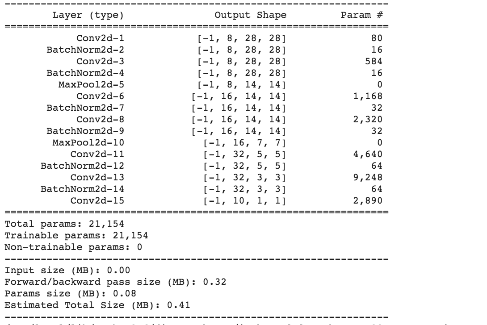
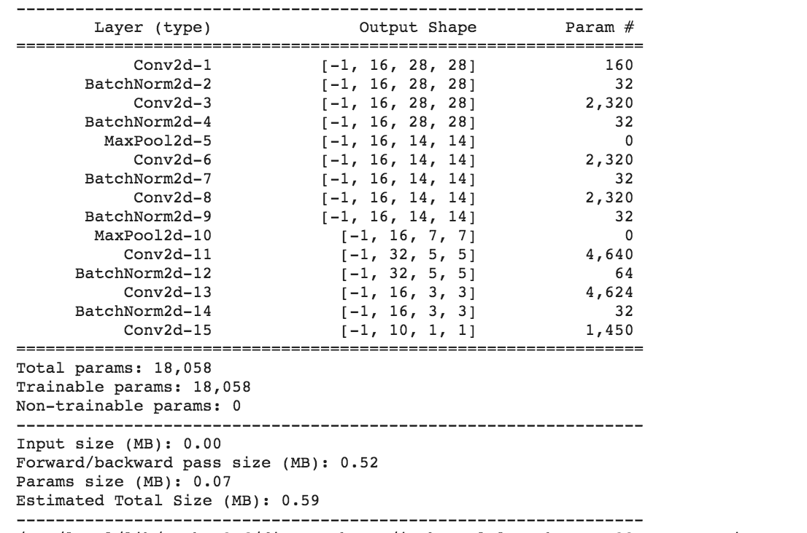
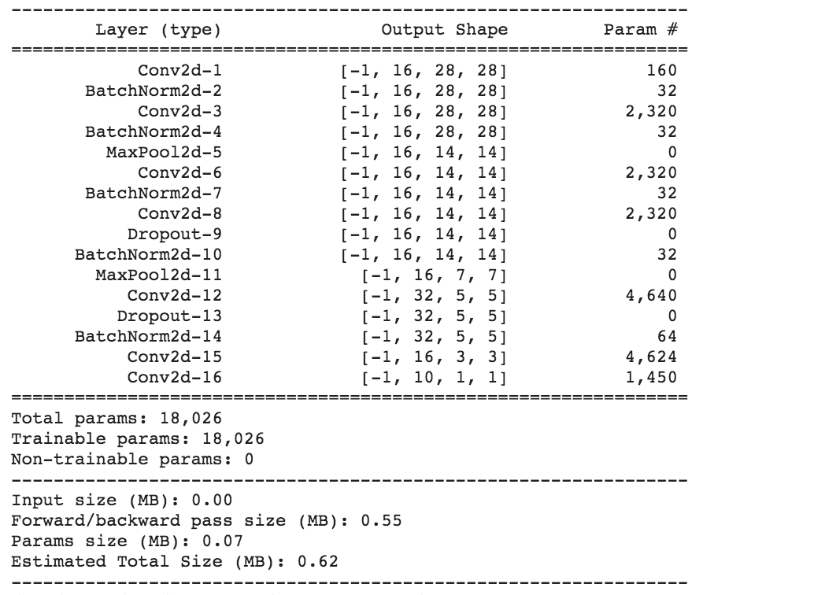
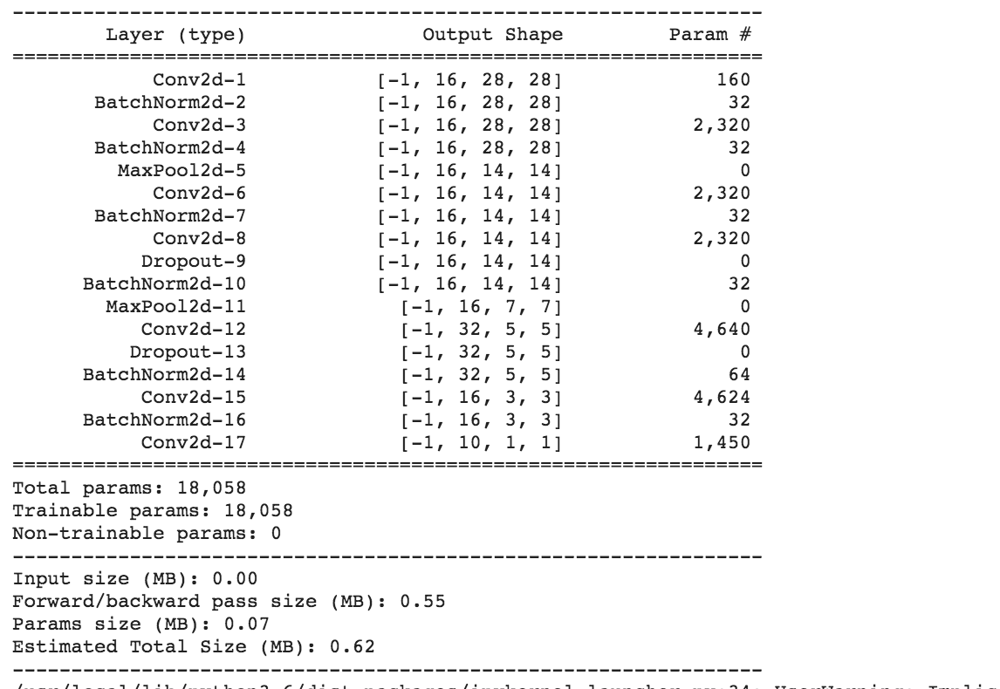
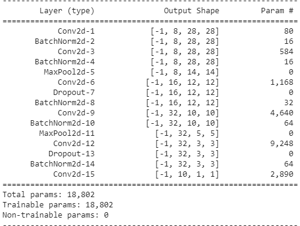
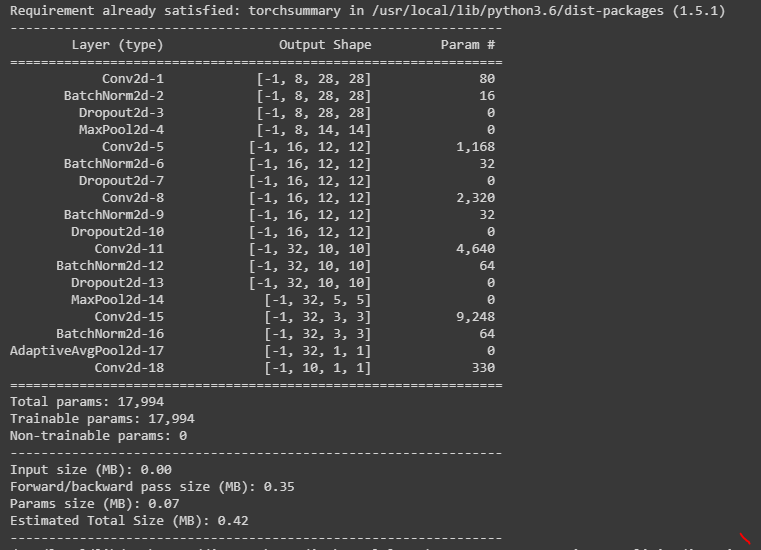

## Session 4 Assignment - Team Submission
Team Members
1. S.A.Ezhirko
2. Naga Pavan Kumar Kalepu
3. Varsha Raveendran
**********************************************************************************************************************
### Version Number: Version 1.

Architecture :    

Description :  
* Added Batch norm after each layer, number of channels updated in each layer from 8 till 32 geometrically

Results : 

          Test accuracy is 99.44% but number of parameters around 21000

**********************************************************************************************************************
### Version Number: Version 2.

Architecture :    

Description :  
* Reduced number of paramters below 20000 but didn't reach target test accuracy 99.4 %

Results : 

          Test Accuracy is 99.37

**********************************************************************************************************************
### Version Number: Version 3.

Architecture :    

Description :  
* Observed model was overfitting in the version 2, so added dropout layers after conv4 and conv5 as we should not add near final output layer and got target accuracy and removed batchnorm before the last layer

Results : 

          test accuracy is 99.43%

**********************************************************************************************************************
### Version Number: Version 4.

Architecture :    

Description :  
* Added batch norm before the last layer and hit the highest test accuracy of all the versions which is 99.5 % at epoch 12 & 17 at below notebook
* Number of parameters = 18,058

Results : 

          v4.1 - test accuracy - 99.53% at epoch 15 at learning rate =0.02 

          v4.2 - test accuracy - 99.5% at epoch 15 at learning rate = 0.01
**********************************************************************************************************************
### Version Number: Version 5.

Architecture :    

Description :  
* Added only 6 Convolution layers. 
* Added Batch Normalization at each layer except last layer. 
* Added Dropout layer at 3rd and 5th convolution layer. Tried with 0.12, 0.10, 0.15 Dropout values. 
* Tried 0.02 and 0.01 as learning rates.
* Number of parameters = 18,802 

Results : 

          v5.1 - test accuracy - 99.55% at epoch 16 at learning rate =0.02 with BatchNormalization at end of each layer and drop out of 0.15

          v5.2 - test accuracy - 99.5% at epoch 13 at learning rate = 0.01 with BatchNormalization at end of each layer and drop out of 0.15
          
          V5.3 - test accuracy - 99.39% at epoch 8 with drop out = 0.10
          
          V5.4 - test accuracy - 99.41% at epoch 9 with drop out = 0.12
**********************************************************************************************************************
### Version Number: Version 6.

Architecture :    

Description :  
* Added 5 convolution layers with 3X3 kernel and 1 layer with 1X1 kernel. The 1X1 kernel layer reduced the number of parameters in the last layer. 
* Used AdaptiveAvgPool2d to reduce the spatial dimensions to 1X1 before applying 1X1 conv layer. 
* Applied batch normalization and dropout (except 5th and 6th conv layer) to all convolution layers except the last one.
* Number of parameters = 17,994

Results : 

          Test accuracy - 99.4% at epoch 14; learning rate = 0.01; 
**********************************************************************************************************************
