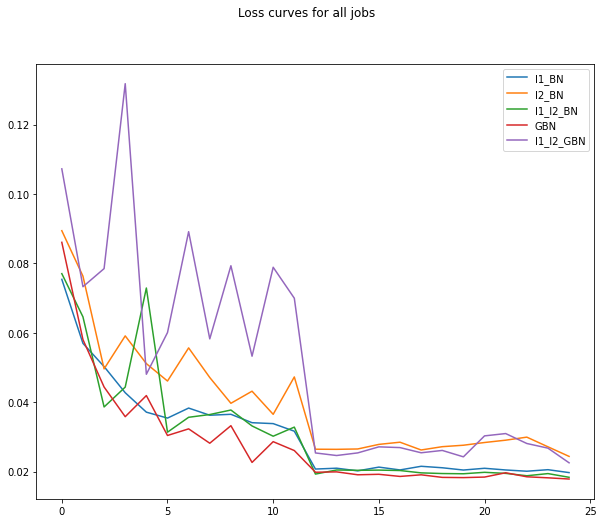
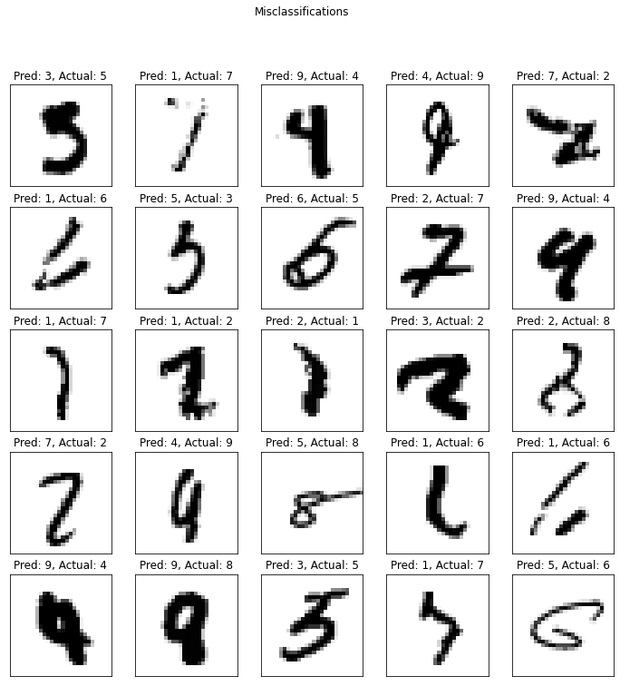

## Session 6 Assignment - Team Submission
Team Members
1. S.A.Ezhirko
2. Naga Pavan Kumar Kalepu
3. Varsha Raveendran
**********************************************************************************************************************

### Code Explanation

Base Code: The base CNN model is taken from the previous Version 6 of Session 5 assignment. The Base CNN architecture consists of 6 Convolution layers, 1 max pool at GRF = 5, and a Global Average pooling layer at the end. The total number of parameters in the CNN Model is 7,612 and the best training accuracy achieved in 15 epochs is 99.41 and best validation accuracy achieved in 15 epochs is 99.49

Following regularization, experiments are performed on the base CNN model.

1. with L1 + BN
2. with L2 + BN
3. with L1 and L2 with BN
4. with GBN
5. with L1 and L2 with GBN

Technique To choose Lambda Values

To find the best hyper-parameter value (Lambda value) for L1 and L2 for above-stated combinations, the custom Grid Search technique is used. The custom grid search algorithm sequentially trains the CNN model with a range of hyper-parameter values for l1 with BN, l2 with BN, l1&l2 with BN & l1&l2 with GBN. The custom grid search algorithm takes in a range of values from 4 buckets [0,0.0001], [0,0.001], [0,0.01],[0,0.1]. The first range from the bucket is taken and 20 uniform distributed random values are picked within those ranges. In order to give equal priority to all the values in the range, the uniform distribution is chosen over normal distribution. The picked random value is assigned to L1, L2, and L1 + L2 regularization, and the model is trained for 15 epochs. The best validation accuracy is then taken and saved to compare with the next set of random values. On completion of 20 trials on a given range, the random value that gave the best validation accuracy is taken and saved to compare against with another range of values. This experiment is repeated for chosen 4 ranges and the random value that gave the best validation accuracy among the 4 ranges is chosen to be the lambda value for the regularization.
With above approach Coarse and Finer search 4 * 4 * 20 * 15 = 4800 epochs overall to get best parameters for 4 models (l1, l2, l1&l2) with BN & l1&l2 with GBN.

- 4 - number of models
- 4 - number of ranges
- 20 - number of random values per range
- 15 - number of epochs
  
Total 4800 epochs to get the best parameters.

Performing the Regularization experiment on Base model with selected best hyper-parameters

Two network architecture classes are created, one for the model with BatchNormalization and another one for the model with GhostBatchNormalization. A factory method will create and return an object based on the experiment chosen. All the experiments with their best hyper-parameter are added to a model dictionary. This dictionary contains the object of the experiment model and its hyper-parameters. By looping over this dictionary, each model is sequentially trained and validated. The training loss, training accuracy, test loss, test accuracy are stored to plot the loss and accuracy graph and compare the performance of these regularizations.

Test Loss Graph for 5 experiments

    
 
Explaining the loss curve

L1 with BatchNormalization: The loss curve is displayed in Blue. The curve shows that loss keeps decreasing consistently over 12 epochs and becomes stable after 15 epoch. The learning rate is reduced after 12 epochs and we can see that model is not efficiently learning after 15 epochs.

L2 with BatchNormalization: The loss curve is displayed in Orange. The curve shows that loss decreases but not at a steady rate. There is a fluctuation in loss from Epoch 3 to Epoch 12. The learning rate is reduced after 12 epochs and we can see that loss still fluctuates and it is not stable.

L1 + L2 + BatchNormalization: The loss curve is displayed in Green. The curve shows that loss keeps decreasing consistently over 12 epochs with little fluctuation and becomes stable after 15 epoch. The learning rate is reduced after 12 epochs and we can see that model is not efficiently learning after 15 epochs.

Ghost BatchNormalization: The loss curve is displayed in Red. The curve shows that loss keeps decreasing consistently over 12 epochs with little fluctuation and becomes stable after 15 epoch. The learning rate is reduced after 12 epochs and we can see that this is the model with very low loss and is a good model comparatively.

L1 + L2 + GhostBatchNormalization: The loss curve is displayed in Purple. The curve shows that loss keeps decreasing but not at a steady rate. There is a fluctuation in loss from Epoch 3 to Epoch 12. The learning rate is reduced after 12 epochs and we can see that loss still fluctuates and it is not stable.

Validation Accuracy Graph for 5 experiments

  
 
From the graph, we can see that L1 + L2 + BatchNormalization and GhostBatchNormalization gives the best accuracy score, but the model with L1 + L2 + BatchNormalization is not consistent. We can see the loss and accuracy are fluctuating. The Model with GhostBatchNormalization gives good accuracy with consistency. So this is a good model comparatively.

Misclassified Images from the model with GBN

    
