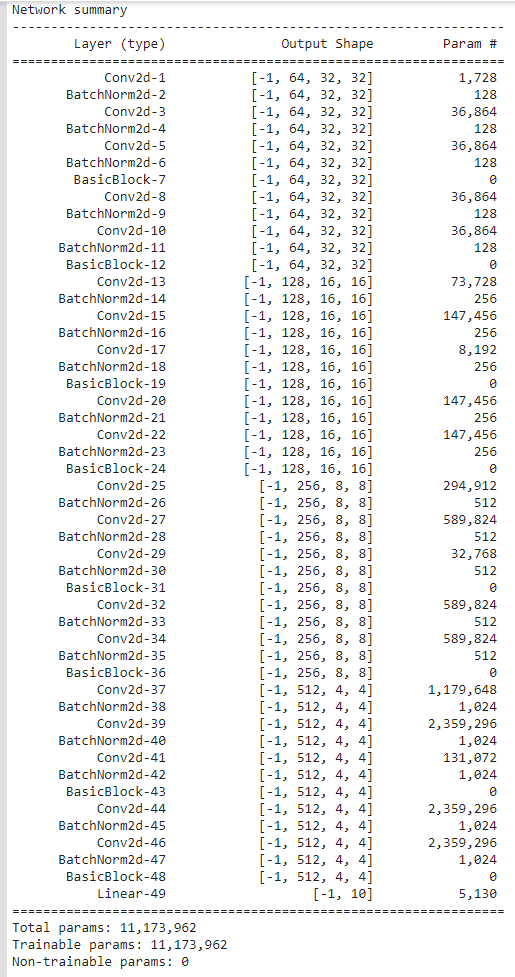
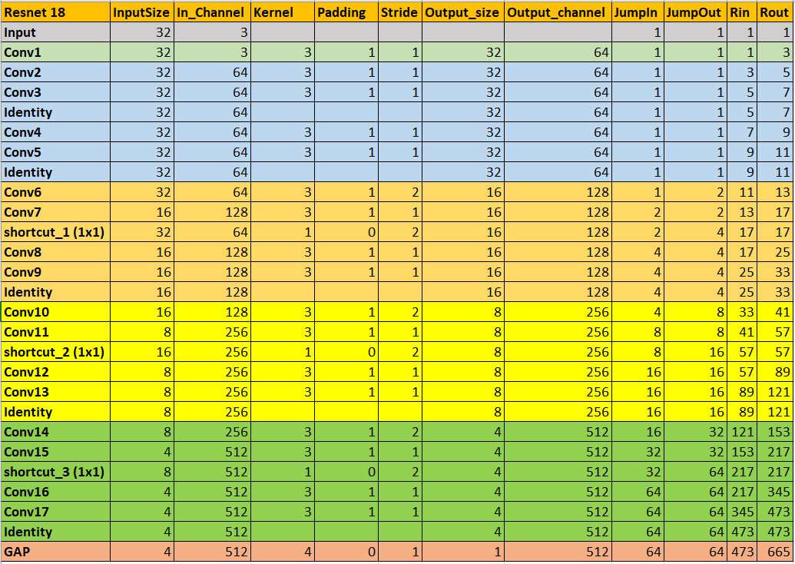

## Session 8 Assignment - Team Submission
Team Members
1. S.A.Ezhirko
2. Naga Pavan Kumar Kalepu
**********************************************************************************************************************
### Executed RESNET18 model on CIFAR10 dataset.
Architecture:  

 
Receptive Field:  

Explanation :  
* Extracted the Resnet.py model file from [kuangliu Reporsitory](https://github.com/kuangliu/pytorch-cifar/blob/master/models/resnet.py) and added it to our API [Assignment Reporsitory](https://github.com/eva5covergence/EVA5_AI_Projects_new/tree/master/models/networks)
* Dryrun the model file manually to understand the Resnet18 Architecture.
* The channels are increased in a hierarchical order of 64,128,256,512.
* The BasicBlock contains 2 convolutional layers followed by batch normalization layer. After these two operations, a shortcut layer is added to copy the input as it is and add it to the output of previous 2 convolutional operations or, Convolve the input channel with 1x1 kernel with stride 2 to reduce its size and then add it to the output of previous 2 convolutional operations. This is called the residue that is being added. 
* The size of channel is reduced by using strides. Stride value of 2 is used to reduce the channel size before starting of every convolution block.
* A Global Average Pooling is applied on the last layer with output size 4 is reduced to size 1 with 512 channels.
* Fully connected linear layer is added with 10 neurons for 10 classes after GAP.
* The model has overall Global Receptive Field of 665. 
* The model does not use softmax activation at the output layer and used CrossEntropy loss function in its train method. As our existing train method was using negative log loss function, we added log softmax function to output layer.
* The model is trained for 
  - 350 epoch 
  - batch size = 128
  - Learning rate = 0.1
  - Step size = 150
  - gama = 0.01
  - Random Rotation = 7 degree
  - Horizontal Flip
  - Random Crop with output size = 32 and padding = 4

Accuracy :  
* Best training accuracy = 99.76 %
* Best test accuracy = 92.65 %

Result:  
* We have achieved the required accuracy of 85% and above.
* The model is overfit.
