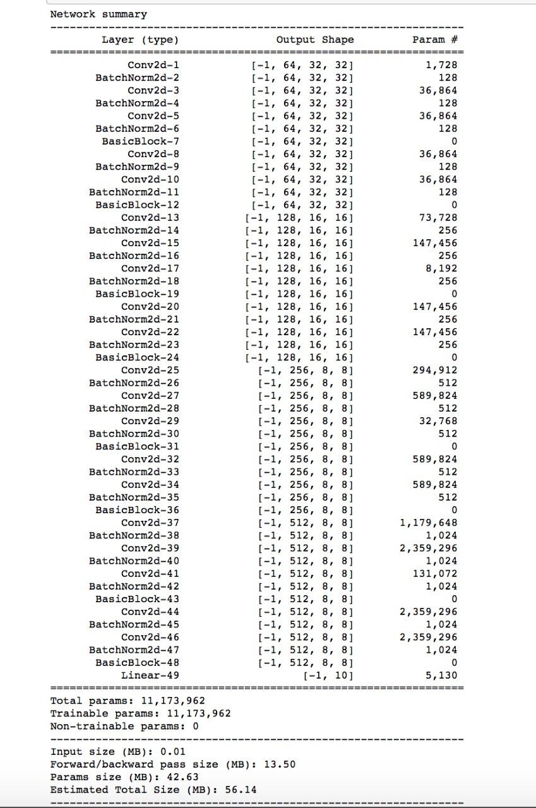

## Session 9 Assignment - Team Submission
Team Members
1. S.A.Ezhirko
2. Naga Pavan Kumar Kalepu
**********************************************************************************************************************
### Implemented Image Augmentation using Albumentation package.
**Model Architecture**: Resnet18  
   
 
**Dataset** : CIFAR10  
**Augmentation Applied** : 
1. ShiftScaleRotate with values
   * shift_limit = 0.0625
   * scale_limit = 0.1
   * rotate_limit = -7,7
2. RandomSizedCrop with values
   * height = 32
   * width = 32
   * min_max_height = 28,28
3. HorizontalFlip

**Explanation** :  
* Image augmentations are very important technique in improving the model's prediction by providing several variations of the images in the training set. Albumentation package is chosen for augmentation due to its faster processing capabilities over other augmentation packages.
* Installed the latest version of Albumentation in google colab
* Imported the Albumentation library to our Data transformation module [base_data_transforms.py](https://github.com/eva5covergence/EVA5_AI_Projects_new/blob/master/data/data_transforms/base_data_transforms.py) inside our API repository
* Created a separate function which will implement the image augmentation from Albumentation package and old function that uses torchvision transforms will be used by older assignments.
* Layer 4 of the Resnet18 model is modified to have 8x8 as the output size in order to feed the gradcam to generate better heatmap of the learnt features which helped to predict the class.   
* The augumentation related to colors for example: RandomBrigtnessContrast, RandomGamma, CLAHE, HueSaturationValue and ChannelShuffle was first tried in a sequence to check the model's training time and accuracy.
* The above color augmentation resulted in increasing training time and huge overfitting. This could be as a result of improved colors variations in training images that could have led the model learn good edges, texture and pattern. When tried to predict on the test image, due to absence of improved color features, the test accuracy was bad and led to overfitting.
* As color augmentation did not yeild good results, Positional augmentation like ShiftScaleRotate, RandomSizedCrop and HorizontalFlip was used. This augmentation reduced the training time, reduced the overfitting and improved the test accuracy.
* The model after training for 350 epochs resulted in the training accuracy of 99.97% and test accuracy of 91.73%.
* The Gradcam code was taken from [pytorch-gradcam 0.2.1](https://pypi.org/project/pytorch-gradcam/#files) and placed in our repository [gradcam module](https://github.com/eva5covergence/EVA5_AI_Projects_new/tree/master/models/gradcam)
* The Trained model was made to do prediction on test data using test dataloader, the test images were passed to the gradcam class to get the mask and heatmap image. 
* A custom Gradcam image visualization function is written which will display required number of correctly predicted and misclassified images with their gradcam heat map along with their actual and predicted label. By default, the function display 5 correct classified images and 5 missed classified images.

**Accuracy** :  
* Best training accuracy = 99.97 %
* Best test accuracy = 91.73 %

**Result** :  
* We have achieved the required accuracy of 87% and above.
* The model is overfit.
