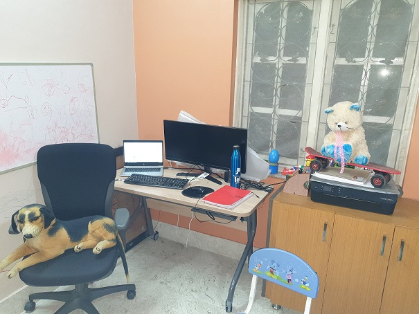

## Session 13 Assignment - Team Submission
Team Members
1. S.A.Ezhirko
2. Naga Pavan Kumar Kalepu
**********************************************************************************************************************
### OpenCV Yolo.

1. Used the code example and the pre-trained yolo weights available in the [location](https://pysource.com/2019/06/27/yolo-object-detection-using-opencv-with-python/) for implementation.
2. Went over the configuration settings mentioned in yolov3.cfg and understood the below important terms needed for second assignment
    - burn_in: Similar to warmup in one cycle policy. The learning rate reaches to maximum till this epoch and then lowers to reach the best minima.
    - max_batches: The training will be processed for this number of batches only.
    - steps : at these numbers of iterations the learning rate will be multiplied by scales factor
3. Looked at coco.names and got to know the list of classes that model is capable of identifying
4. Used the below image of my room for detection

   
  
5. The resultant image after bounding box prediction of classes and their probability.

   

**********************************************************************************************************************
### Training Custom Dataset on Colab for YoloV3
Annotated 150 images of people wearing below items using yoloV3 annotator tool.
1. hardhat
2. vest
3. mask
4. boots

## Implementation
1. Downloaded 3590 images
2. Refered [this](https://github.com/theschoolofai/YoloV3) repo for implementation.
3. Modified custom.data file to have 4 classes and point to our train, validation and class names files as mentioned in the setup step.
4. Updated the yolov3-custom.cfg to have 
    - filters = 27 ((4+1+4)*3 = 27)
    - classes = 4
    - burn_in = 16 (because i trained only for 50 epochs)
    - max_batches = 5000
    - steps = 4000,4500
5. Created a script to detect the training image file size and updated the custom.shapes files. One for training and another one for testing.
6. Corrected the wrong file extension like image_001.txt instead of image_001.jpg and bounding box normalization values that were more than value 1.
7. Ran the trainning for 50 epochs, due to colab constraint.
8. Downloaded different variations of videos of people wearing hardhat, vest, mask and boots. Joint the videos making it a single video of 1 minute.
9. Used FFMPEG library to split the video into image frames. Got about 1780 images and other team mate got 2691 images for his video.
10. Passed the frame images to detect the bounding boxes and saved the tagged images back to different folder.
11. Again used FFMPEG library to convert the frame images back to single video.

## **Trained Samples**

   

## **Results**
   

## **Video output**
S.A.Ezhirko: https://www.youtube.com/watch?v=W5vej8zcso8

Naga Pavan kumar: https://www.youtube.com/watch?v=PxkEbky1M1I&feature=youtu.be

